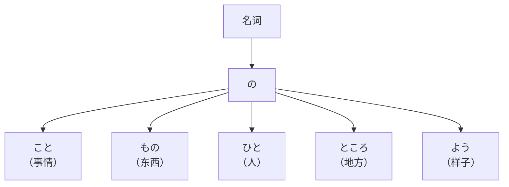
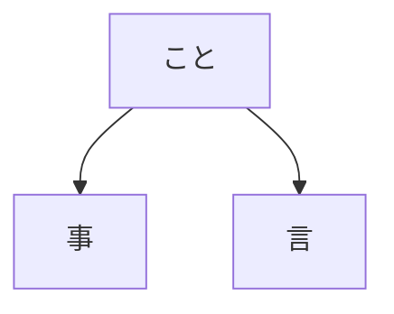
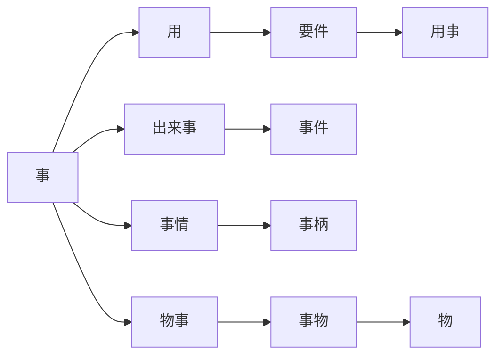
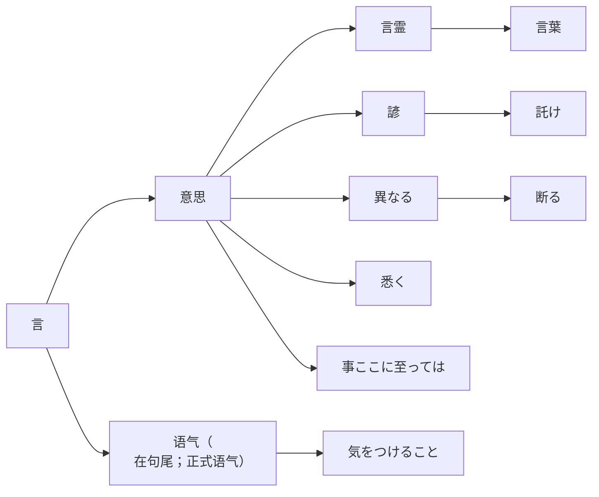
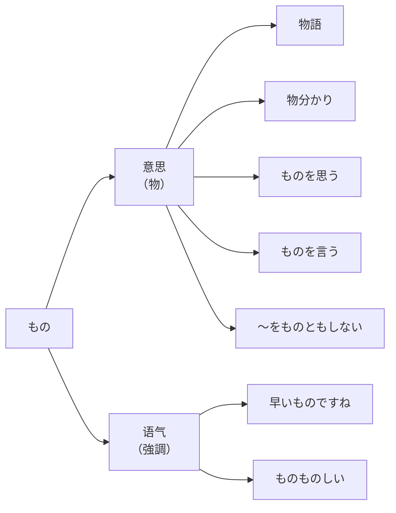
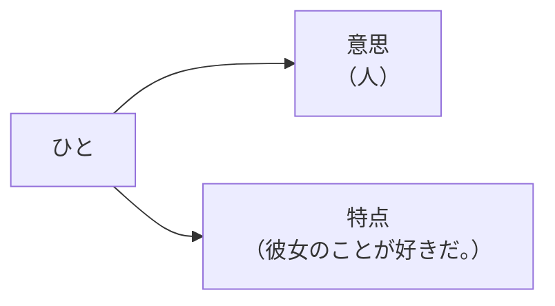
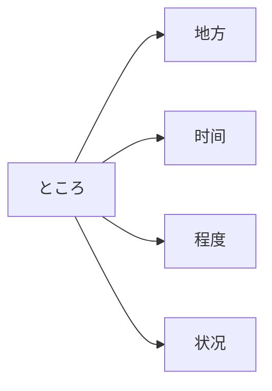
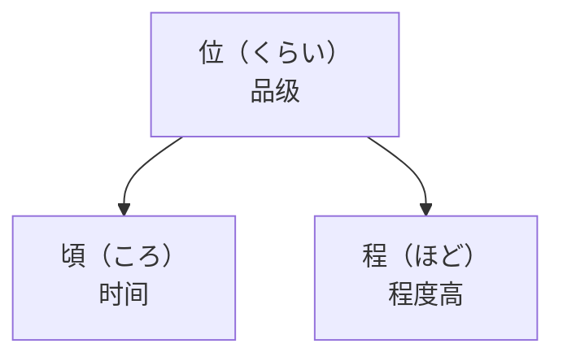
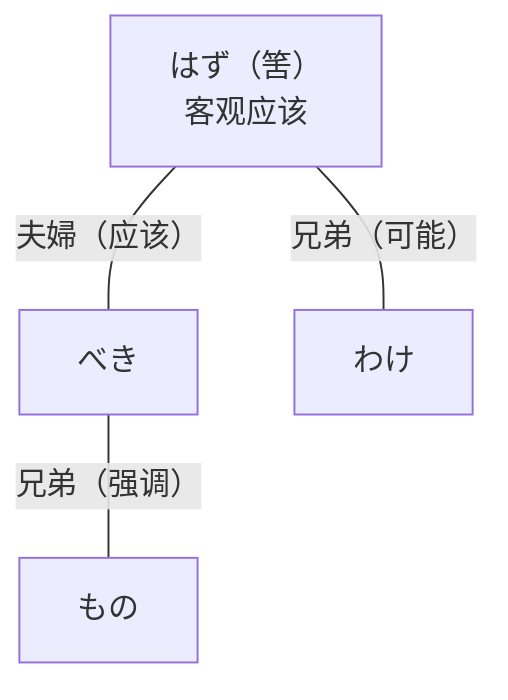
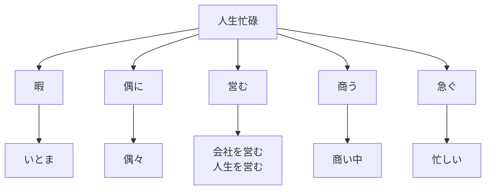

# 名词

## こと

言霊「ことだま」

- 用「よう」要去做的事
- 要件「ようけん」要件（工作上的事；留言电话）
  - 单独「件」也可以
- 用事「ようじ」更加生硬的「用」（生活当中使用）
- 出来事「できごと」发生的事情（ニュース → 今日の出来事）
- 事件「じけん」事件（升级）
- 事情「じじょう」特殊的情况（事情がある → 有特殊情况）
- 事柄「ことがら」事情的本身内容，具体意思
  - 柄「がら」花样
  - 人柄「ひとがら」人品
  - 身柄「みがら」本人
    - 身柄確認「みがらかくにん」确认身份
    - 身柄確保「みがらかくほ」拘留
- 物事「ものごと」（总的）事物
- 事物「じぶつ」（具体）对象、事物

- 言霊「ことだま」言灵
- 言葉「ことば」词语
- 諺「ことわざ」谚语（わざ → 技・業）
- 託け「かこづけ」口信（付ける）
- 異なる「ことなる」不同（成为一件事 → 不同；自动词 → 形容词）
- 断る「ことわる」拒绝（用语言分割 → 拒绝）

  - 割る「わる」
  - 「お断ります」自谦拒绝

- 悉く「ことごとく」全部，所有

  - 副词的标志「く・と・に」

- 事ここに至っては（事到如今）
- 気をつけること「きをつけること」注意事项

## もの

- 物語「ものがたり」故事
  - 故事「こじ」真的发生过的事
  - 語る「かたる」讲述（かた →「方・片・肩」）
- 物分かり「ものわかり」理解，懂事
- ものを思う（想事，思考）
- ものを言う（说事，发言）
- 〜をものともしない（都不把…当回事 → 不顾；不受〜影响）
  - 親の反対をものともしない
- 早いものですね（时间过得真快啊）
- ものものしい（戒备森严的；小题大做的）
  - 「し」→ 像（古语）
- 者「もの」（生硬礼貌）私は田中という者です。

## ひと

- 人は落ち目が大事「ひとはおちめがだいじ」在低谷时期最为重要
  - 落ち目「おちめ」颓势；逆境
- 人当りがいい「ひとあたりがいい」性格温和
  - 人当り（给人留下的印象）
  - 当たり（命中）
  - 当てる（碰；命中；成功）
- 他の人「ほかのひと」其他人
- 赤の他人「あかのたにん」完全陌生的人
  - 他の人
  - 他人 → 生硬；没有关系的人
- 人をたてる「ひとをたてる」给人面子（把人立起来 → 抬举，尊重，辅助）
- 人を見る目「ひとをみるめ」识人眼光
  - 人を見る目を肥やす（肥やす → 积累经验）
  - 人を見る目がない
- 人柄「ひとがら」个性
- 質「しつ・たち」本质
  - 「たち」只能说人 → たちが悪い
- 人よし「ひとよし」老好人（↑↓）
- 人手「ひとで」劳动力（人手が足りない）
- 人ごみ「ひとごみ」人群
- 人探し「ひとさがし」寻人
- 人々「ひとびと」人们
- 人並み「ひとなみ」一般水平；跟别人一样
  - 人並みの生き方・暮らし
  - 並みサイズ（均码）
  - 月並み（平常的）
- 人影「ひとかげ」人影（かげ →「影・陰」）
- 人っ子一人いない（一个人也没有）

## ところ

地方

- 所々「ところどころ」各处
- 部長のところ「ぶちょうのところ」部长那…
  - 私のところ（我这…）
- 所構わず「ところかまわず」不管什么地方／随地／不分场合
  - 構う「かまう」管，理
- 所狭しと「ところせましと」地方狭窄（狭い「せまい」）
- 箇所「かしょ」地点
- 箇条「かじょう」条款
- 箇条書き「かじょうがき」项目列举

时间

- 语法（时态）

  - するところ（刚刚要做）
  - しているところ（正在）
  - していたところ（刚在一直）
  - したところ（刚刚做了）

- 時「とき」时间

  - 若い時
  - 子供のとき・頃

- 時計「とけい」钟表

  - 腕時計・掛け時計・置き時計

- 鐘「かね」钟
- 提灯と吊鐘「ちょうちんとつりがね」天壤之别

  - 月とすっぽん

- 金「きん」金

  - お金・金持ち

- 金具「かなぐ」金属配件
- 金使いが荒い「かねづかいがあらい」挥金如土

  - 荒い「あらい」① 粗暴的 ② 疯狂的

- 金がものを言う（金钱至上；有钱能使鬼推磨）
- 金の切れ目は縁の切れ目（金钱断尽情谊绝）
- 金銭「きんせん」金钱
- 銭「ぜに」钱
- 小銭「こぜに」零钱

程度

- どころか（哪是～状况啊）
- どころではない（不是～程度）
- 〜といったところです（だけ；就这程度）
- くらい

位「くらい」地位

- 位が高い「くらいがたかい」社会地位高

頃「ころ」时候

- 子どもの頃（童年时期）
- 中頃「なかごろ」中旬，中期
- 近頃「ちかごろ」近来，最近
- 今頃「いまごろ」现在（比「今」高级）
- 日頃「ひごろ」平时
- 見頃「みごろ」最佳观赏期，正好看的时候

程「ほど」程度

- ほどがある「ほどがある」有限度
- 〜程々にする「〜ほどほどにする」适度；适可而止
- 程よい「ほどよい」适中；正好
- 程近い「ほどちかい」比较近
- 程遠「ほどとおい」比较远
- 身の程知らず「みのほどしらず」不自量力
- 〜のほど宜しくお願いします

  - 末長いお付き合いのほど宜しくお願い申し上げます。

程度「ていど」程度偏低

- この／これぐらい（程度低）
- 度合い「どあい」程度（中性）
- レベル（水准）
- 次元「じげん」维度｜次元が違う（层次不同）

## よう

- 様「よう」样子（主要用在语法上）
  - 様変わり「さまがわり」变化；不一样
- 様子「ようす」状况，情况
  - 樣相「ようそう」相貌；事情的状态（※最难）
  - 樣態「ようたい」样态
  - 状態「じょうたい」状态
- ありよう「ありよう」存在方式
  - ありさま「ありさま」情形
  - ありかた「ありかた」存在方式
- そぶり［日语］样子
  - 姿「すがた」形态
  - 身振り「みぶり」姿态
    - 振り（样子）
    - ～振りをする（装…样子）
  - 手振り「てぶり」手势
  - 話振り「はなしぶり」谈吐
  - 仕事振り「しごとぶり」工作态度
- 状况「じょうきょう」情况
  - 具合「ぐあい」① 状况 ② 身体状况
  - 調子「ちょうし」状态
  - 都合「つごう」情况
    - ご都合はいかがでしょうか。
    - 都合がいい・悪い
  - 不都合「ふつごう」不便
  - 体調「たいちょう」身体状况
  - 口調「くちょう」语气；口吻
  - 気分「きぶん」心情（抽象的身体不好）
  - 気「き」气氛（気がある？）
  - 気持ち「きもち」感情（外在的带给的感觉）
  - 機嫌「きげん」心情｜機嫌を取る（讨人喜欢）
  - 気合い「きあい」斗志｜気合いを入れる（加把劲）

## はず＆べき

- はず（主观的应该）
- べき（责任义务的应该）

  - 古代汉字「可」
  - 「き」→ 古语名词的标志；形容词修饰名词的标志（いい人 → よき人）

- わけ

  - わけ → 分支
  - 訳 → 道理（语言分枝）

- もの
- 〜はずがない（不可能）
- 〜わけがない（不可能）
- 〜べきではない（不应该）
- 〜ものではない（不应该）

## あ

意思：啊；明亮；上

- 油「あぶら」油
- 油に水「あぶらにみず」水火不相容
- 油を売る「あぶらをうる」磨洋工
- 油断する「ゆだん」大意
  - 油断は大敵
- 脂っこい「あぶらっこい」油腻
  - 濃い「こい」
  - あっさり（清淡）
- 過ちを犯す「あやまち」犯错误
  - 謝る・誤る「あやまる」
  - 過つ「あやまつ」
- 嵐「あらし」风暴
- 荒い「あらい」疯狂的
  - 荒々しい「あらあらしい」
  - 荒れる「あられる」
- 粗い「あらい」粗糙
- 粗探し「あらさがし」挑剔，找毛病
- 赤い「あかい」① 红的 ② 赤裸裸的
- 青い「あおい」蓝
- 藍「あい」靛蓝色
- 秋「あき」秋天
  - 財布 → 秋天不要送（あき → 空き；春 → 張る）
- 朝「あさ」早晨
  - 朝顔「あさがお」牵牛花
  - 朝早く「あさはやく」清晨
  - 朝市「あさいち」早市
  - 朝晚「あさばん」从早到晚（训＋音）
- 麻「あさ」
- 痣「あざ」胎记；瘀伤
- 鮮やか「あざやか」鲜艳（やか・らか → 形容动词的后缀）
- 欺く「あざむく」欺骗
  - 騙す「だます」
- 兄「あに」哥哥
- 姉「あね」姐姐
- 雨「あめ」雨
  - 雨具「あまぐ」雨具
  - 雨宿り「あまやどり」避雨
  - 雨傘「あまがさ」雨伞（かさ → 笠）
  - 小雨「こさめ」小雨｜大雨「おおあめ」
  - 春雨「はるさめ」春雨｜時雨「しぐれ」秋雨
- 泡「あわ」泡
  - 泡になる「あわになる」化为泡沫
- 網「あみ」网
  - 網状「あみじょう」
  - 網戸「あみど」纱窗
  - 編む「あむ」编织

## い

意思：一个；意识

- 単一「たんいつ」单一
  - 唯一「ゆいつ」唯一
  - 均一「きんいつ」均一
  - 統一「とういつ」统一
- 石「いし」石头
- 石頭「いしあたま」硬脑袋
- 頂「いただき」顶端
  - 峠「とうげ」山口；顶点
  - 山頂「さんちょう」山顶
  - 山の頂「やまのいただき」山顶
  - 頂「いただき」顶点
  - 頂上「ちょうじょう」山顶
  - 山を登る／上る「やまをのぼる／のぼる」爬山
  - 山を下りる／下る「やまをおりる／くだる」下山
  - 歴史を辿る「れきしをたどる」追溯历史
    - 辿る「たどる」追寻…的足迹
    - ここまで辿り着いた「ここまでたどりついた」到达这里
      - 辿り着く「たどりつく」挣扎着走到
  - 登山「とざん」登山
    - 登頂「とうちょう・とちょう」登顶
    - 登
      - 与山相关 →「と」登山「とざん」
      - 与山无关 →「とう」登録「とうろく」
  - 下山「げざん」下山
    - 山
      - 专业名词 →「さん」富士山「ふじさん」
      - 不是专业名词 →「ざん」登山「とざん」
  - 裾野「すその」山脚
    - 裾（衣服的下摆）
  - 山腹「さんぷく」山腹
    - 中腹「ちゅうふく」
  - 麓「ふもと」山脚
  - 袂「たもと」① 袖口 ② 山脚
- 頂く「いただく」接受、领受
  - 戴く「いただく」接受、领受
  - 戴き物「いただきもの」礼物、赠品
- 糸「いと」线
  - 紐「ひも」绳子
  - 縄「なわ」绳索
  - 綱「つな」绳、索（強い縄）
  - ロープ（绳索）
  - リボン（丝带）
- 稻「いね」水稻
  - 稲妻「いなずま」闪电
- 犬「いぬ」狗（ワンちゃん）
  - 犬と猿「いぬとさる」犬与猿（形容关系不好）
  - 犬に論語「いぬにろんご」对牛弹琴
  - 犬の川端歩き「いぬのかわばたあるき」徒劳；瞎溜达；河边散步
  - 犬も食わない「いぬもくわない」极其不受欢迎的东西
- 暇「ひま」

人生忙碌

- 暇「ひま」空闲
- いとま「いとま」空闲（「暇」的古语）

  - ［古语］一つ「いとつ」现在的ひとつ

- 偶に「たまに」偶尔

  - 偶々「たまたま」碰巧（比「偶に」频率低）

- 営む「いとなむ」经营

  - 「いとまがない」← 我没空
  - 会社を営む「かいしゃをいとなむ」经营公司
  - 人生を営む「じんせいをいとなむ」经营人生

- 商う「あきなう」经商（空きがない）

  - 商い中「あきないちゅう」营业中

- 急ぐ「いそぐ」匆忙

  - 忙しい「いそがしい」忙碌

- 今「いま」① 现在 ② 刚才 ③ 马上就要

  - 今帰って来た。
  - 今急いでいる。
  - 今電話する。

- 今更「いまさら」现在再说；强调现在（今更なにを？）
- 今時「いまどき」现在的时代；现如今（今時の若い人）
- 今や「いまや」现在已经（今や時代遅れ）
- 今に「いまに」不久后（比「すぐに」更长一些）
- 未だに「いまだに」现在还没（「いままだ」的古语）
- 今一「いまいち・いまひとつ」不怎么样，还差一点
- 妹「いもうと」妹妹
- 姉妹「しまい」姐妹

## う

意思：屋；无；武；误；涡；鸣；哇；宇

- 牛「うし」牛

  - 牛に経文「きょうもん」对牛弹琴
  - 牛の歩み「あゆみ」缓慢

- 家「うち・いえ」家
- 内「うち」内

  - その内「そのうち」不久后；总有一天

- 裏「うら」背面

  - 裏目に出る「うらめ」事与愿违
  - 裏表がある「うらおもて」表里不一
  - 裏返し「うらがえし」翻转
  - 裏がある「うらがある」① 有背后意图，有内情 ② 表里不一
  - 裏付け「うらづけ」证据，根据
    - 裏付ける「うらづける」证实

- 占う「うらなう」占卜
- 羡む「うらやむ」羡慕

  - 羡ましい「うらやましい」令人羡慕
  - 妬む「ねたむ」

- 恨む「うらむ」怨恨

  - 恨めしい「うらめしい」可恨
  - 恨み「うらみ」怨恨
  - 憎む「にくむ」
    - 憎い
    - 憎らしい
    - 憎たらしい

- 嬉しい「うれしい」高兴
- 憂える「うれえる」忧虑（心配する）

  - 憂き目「うきめ」伤心事

- 嘘「うそ」谎言

  - うそをつく（撒谎）
  - 嘘つき（说谎的人）
  - 詐欺師「さぎし」
  - ペテン師

- 空ろ／虚ろ「うつろ」空洞，空虚

  - 空ろな目つき「うつろなめつき」呆滞的目光
  - 空っぽ「からっぽ」空
  - 空しい／虚しい「むなしい」空洞的，空虚的

- 後ろ「うしろ」后面

  - 後ろを見せる（示弱）
  - 弱みを見せる（示弱）
  - 後ろ盾「うしろだて」后盾

    - 後ろ盾を無くす
    - たて「盾・立・建・縦」
    - たてる「立てる・建てる」

  - 後ろめたい気持ち「うしろめたい」内疚的

- 器「うつわ」容器

  - 器が大きい・小さい
  - 器を磨く
  - その器じゃない（不是那种料）
  - 見せ掛け「みせがけ」假象，虚有其表

- 海「うみ」海

  - 海の幸「うみのさち」海鲜，海味
  - 火の海「ひのうみ」火海

- 渦「うず」① 漩涡 ② 复杂的事件当中

  - 事件の渦に巻き込まれる（卷入事件的漩涡）

- 噂「うわさ」谣言

  - 噂をすれば、影が差す（说曹操，曹操到；谈虎色变）
  - 噂を撒き散らす「まきちらす」散布谣言
  - 噂の種「たね」谣言的来源
  - 噂が噂を呼ぶ（坏事传千里；一传十，十传百）

- 上「うえ」

  - 年上と目上の人「としうえとめうえのひと」年长者和上级
  - 上には上がある（人外有人，天外有天；高人一等）
  - 上役「うわやく」上级｜役職「やくしょく」

- 腕「うで」手臂

  - 二の腕（上臂）
  - 腕がある「うでがある」有能力
  - 腕前「うでまえ」本事，技能
  - 腕を見せる「うでをみせる」展示技能
  - 腕を競う「うでをきそう」比拼技艺
  - 腕が鳴る「うでがなる」跃跃欲试，摩拳擦掌
  - 腕を磨く「うでをみがく」提升技能
  - 腕が冴える「うでがさえる」技艺出众
  - 腕が上がる「うでがあがる」技艺提高
  - 片腕「かたうで」信服，助手

## え

- 駅「えき」

  - バス停、バスの停留所

- 餌「えさ」

  - 甘い餌（糖衣炮弹）
  - 餌やり（投食）
  - 餌やりの時間
  - モグモグタイム

- 枝「えだ」

  - 枝豆「えだまめ」
  - 枝毛「えだげ」头发的分叉

    - かさかさ（皮肤・头发干燥）［か → 火］
    - からから（空气干燥）
    - しっとり（湿润）

  - 枝の雪
  - 西晋孙康－枝头的雪照明－苦学
  - 照明「しょうめい」
  - 苦学「くがく」

- 蝦「えび」海老

  - 蛇「へび」
  - 蝦で鯛を釣る（抛砖引玉）
  - 鯛「タイ」比目鱼（日本人新年时候吃鯛［めでたい → おめでとう］）

- 笑む「えむ」微笑（え → 微笑时的嘴型）

  - 笑み「えみ」笑容
  - 笑う「わらう」大笑
  - 微笑む「ほほえむ」
  - 微笑み「ほほえみ」
  - 笑顔「えがお」
  - 笑窪「えくぼ」酒窝
    - 窪 → 坑
    - 当て字（假借字）大久保、久保田
  - 窪む「くぼむ」凹陷
  - 凹む「くぼむ」
  - 凹む「へこむ」
  - 痘痕も笑窪（情人眼里出西施）
    - 痘痕「あばた」麻子

## お

意思：接头词；大；圆圈

- 塩「しお」（咸 → し）
- 音「おと」

  - 雨の音「おと」
  - 人の声「こえ」
  - 虫の音「ね」

- 同じ人「おなじ」

  - おんなじ（口语）

    - 日语中口语的标志：ん和っ

  - いっしょ「一緒」

- 公「おおやけ」公开

  - 公の場で「おおやけのばで」在公共场合
  - 〜を公にする（使公开／公布）
  - 不祥事を公にする
    - 不祥事「ふしょうじ」

- 狼「おおかみ」
- 男「おとこ」

  - 夫「おっと」
  - 甥「おい」
  - 口语：甥っ子「おいっこ」
  - 姪「めい」
  - 弟「おとうと」
  - 大人「おとな」
  - 大人しい「おとなしい」老实的

- 親「おや」

  - 親方「おやかた」师傅
  - 大家さん「おおや」房东
  - 親御さん（京都方言）ご両親

- 重荷「おもに」负担

  - 荷物「にもつ」

- 表と裏「おもてとうら」表里

  - 表「おもて」表面
  - 本音と建て前
    - 本音「ほんね」心里话
    - 建て前「たてまえ」场面话

- 面「おも」

  - 面白い「おもしろい」眼前一亮的；有意思的
  - 主な「おもな」
  - 主に「おもに」

- 趣「おもむき」情趣，趣味；要点，旨趣

  - 赴く「おもむく」奔赴，前往（おも → 面；むく → 向く）
  - 格別な趣がある（别有一番情趣）
  - 異国の情緒あふれる（充满异国情趣）
    - 情緒「じょうしょ」情趣，风趣
    - 異国「いこく」

## か

意思：渴；火；夹，家，稼，卡拉；加

- 金「かね」钱

  - 鐘「かね」钟
  - 鍵「かぎ」钥匙

- 鼎「かなえ」

  - 鼎の沸くが如し（人声鼎沸）
  - 沸く「わく」
  - 如し「ごとし」似，如，像（古语的形容词结尾）

- 要の所（关键点）

  - 要「かなめ」要点；扇子的枢轴
  - 末「すえ」

- 霞「かすみ」

  - 霞ヶ関「かすみがせき」
  - 霞む「かすむ」朦胧，看不清

- 釜「かま」锅

  - 窯「かま」窑子，炉子
  - 鎌「かま」
  - 鎌倉「かまくら」
  - 釜飯「かまめし」

- 鞄「かばん」
- 空「から」

  - 空っぽ「からっぽ」

- 殻「から」外皮，壳

  - 貝殼「かいがら」
  - 甲羅「こうら」龟、蟹、虾等的甲壳
  - 自分の殻に閉じ籠る
  - 閉じ籠る「とじこもる」

- 体「からだ」

  - 体つき（体形）
  - 顔つき（脸型，长相）
  - 顔立ち「かおだち」脸型，长相

- 柄「がら」花样

  - 人柄
  - 小柄「こがら」小型
  - 大柄「おおがら」大型

- 顔「かお」

  - 〜に合わせる顔がない（没脸去见）
  - 顔を出す（露面）
  - 顔を見せる（露面）
  - 孫の顔が見たい（想见孙子）
  - 顔に泥を塗る（抹黑）｜塗る「ぬる」
  - 顔が広い（脸大 → 交际广）

- 踵「かかと」脚后跟；鞋跟

  - ヒール

- 鏡「かがみ」

  - 鏡餅「かがみもち」
  - 餅「もち」年糕
  - 橙「だいだい」
  - 鑑「かがみ」榜样；借鉴

- 柿「かき」

  - 牡蠣「かき」

- 垣「かき」围墙

  - 石垣「いしがき」石墙
  - 垣根「かきね」墙根
  - 塀「へい」围墙
  - 屏風「びょうぶ」屏风
  - 几帳「きちょう」围屏，幔帐
  - 几帳面「きちょうめん」一丝不苟的

- 影

  - 陰
  - 人影
  - 日蔭「ひかげ」

- 籠「かご」篮子

  - カート
  - 籠耳「「かごみみ」
  - 籠で水を汲む
  - 汲む「くむ」
  - ざるに水
  - ざる（竹笼屉）

- 風「かぜ」

  - 風に靡く（风中飘扬）
  - 靡く「なびく」
  - 風薫る五月
  - 薫る「かおる」

- 風邪

  - 風邪を引かないように（避免感冒）
  - 風邪気味「かぜぎみ」有点感冒

- 方「かた」
- 肩「かた」

  - 肩凝り「かたこり」肩酸
  - 凝る「こる」
  - この細工はなかなか凝っている。
  - 肩を並べる（并肩）
  - 並べる「ならべる」
  - 肩を抜く（逃避责任）
  - 責任逃れ「のがれ」
  - 逃れる「のがれる」逃避，规避
  - 〜の肩を持つ（袒护）
  - 肩身の狭い思いをする（寄人篱下）
  - ～思いをする
  - 肩身の狭い

- 片「かた」

  - 片〜（两个中的一个）
  - 片耳・片手
  - 片腕（左膀右臂・心腹）

- 刀「かたな」

  - なた（柴刀）

- 形「かたち」
- 敵 ①「てき」②「かたき」

  - 仇「あだ」→ あちらだよ！
  - 敵を討つ（讨伐敌人）
  - 討つ「うつ」

- 角「かど」

  - 角が立つ（有棱角，不圆滑）
  - 角「つの」犄角

- 壁「かべ」

  - 壁に突き当たる（碰壁，碰钉子）
  - 突き当たり「つきあたり」尽头

- かび（霉）

  - かびが生える
  - 生える「はえる」长出来
  - 生やす「はやす」
  - かび臭い（过时的）

- 川・河「かわ」
- 皮「かわ」

  - 毛皮「けがわ」
  - 餃子の皮

- 革「かわ」

  - 本革「ほんがわ」真皮
  - 合成「ごうせい」
  - レザー

- 瓦「かわら」

  - 珠玉の瓦礫に在るが如し（被埋没）
  - 珠玉「しゅぎょく」
  - 瓦礫「がれき」

- お粥「おかゆ」

  - 雑炊「ぞうすい」杂烩粥
  - 雑色駅

## き

意思：① き気 ② きん金 ③ こ小

- 肝・胆「きも」

  - 肝試し「きもだめし」试验胆量

- 切る「きる」（语法：① 中断 ② 完全）
- 霧「きり」雾
- 錐「きり」锥子
- 岸「きし」

  - 岸部「きしべ」

- 際「きわ」

  - 水際「みずぎわ」水边
  - 山際「やまぎわ」山脚，山边

- 極めて〜（及其）

  - 極み（n.及其）
  - 極まりない
  - 究める「きわめる」研究，探明

- 桐「きり」

  - 皇室の紋章
  - 皇室「こうしつ」
  - 紋章「もんしょう」
  - 大判「おおばん」
  - 小判「こばん」
  - 猫に小判（对牛弹琴）

## く

意思：苦；こ小；咕噜；方向

- 癖「くせ」

  - 口癖「くちぐせ」口头禅
  - 体癖「からだぐせ」
  - 癖がある（有特点）

- 草「くさ」

  - 草花「くさばな」
  - 草木「くさぎ」

- 臭い「くさい」

  - 酒臭い「さけくさい」
  - 汗臭い「あせくさい」
  - 水臭い「」水气重
  - 青臭い「あおくさい」青涩的
  - 生臭い「なまぐさい」世俗的，势力的；腥臭的

- 薬「くすり」

  - 薬を飲む
  - 薬が効く
  - 効く「きく」有效，生效
  - 空调很冷时 ① 寒い ② 効きすぎ ③ 冷えてる
  - 漢方医「かんぽうい」

- 屑「くず」渣子

  - 紙屑「かみくず」
  - 屑箱「くずばこ」
  - ゴミ箱
  - 人間の屑（人渣）

- 窪「くぼ」
- 車「くるま」

  - 輿「こし」轿子，肩舆
  - 輿入れ（出嫁）
  - 嫁入り「よめいり」出嫁
  - 嫁入り道具（嫁妆）
  - 嫁ぐ「とつぐ」
  - 娶る「めとる」

- 蜘蛛「くも」
- 雲「くも」

  - 曇る「くもる」

- 黑「くろ」

  - 玄人「くろうと」
  - 素人「しろうと」

- 首「くび」

  - 首にする（解雇）
  - 首になる（被解雇）
  - 首を長くして待つ（翘首以盼）
  - 首を傾げる（无法理解）
  - 傾げる「かしげる」倾斜
  - 首を突っ込む（插手干预别人的事情）
  - 突っ込む「つっこむ」深入调查，详细检查
  - どんどん突っ込んでください（请积极提出意见批评）

- 釘「くぎ」

  - 釘を刺す「くぎをさす」事前说定，强调注意事项

- 鎖「くさり」

  - 鎖状「さじょう」
  - チェーン

- 串「くし」肉串

  - 櫛「くし」梳子
  - 櫛の歯の如し（马不停蹄）
  - 間一髪「かんいっぱつ」千钧一发

- くじ

  - おみくじ（神签）
  - くじ引き（抽签）
  - くじ引きで決める
  - 宝くじ（彩票）

## け

意思：き気；こ小、下

- けち（小气）

  - けちる（小气）
  - 食費をけちる。
  - 渋い「しぶい」小气的

- 煙「けむり」

  - 煙が立つ（起烟）
  - 煙る「けむる」冒烟；模糊不清
  - 煙たい「けむたい」烟气熏人

- 毛「け」
- 獣「けだもの」
- 下駄「げた」木屐

  - 下駄箱「げたばこ」
  - 靴箱

## こ

意思：固；过；己；小；这

- 氷「こおり」冰

  - 凍る「こおる」
  - 凍らせる
  - 解凍

- 心

  - 心に留める（放在心里）
  - 留める「とめる・とどめる」
  - 心に刻む
  - 刻む「きざむ」
  - 心に刻まれている
  - 心にもないこと（不是真心的）
  - 心を打つ（打动心扉）
  - 心を打たれる（我被打动）
  - 心が打たれる（心被打动）
  - 心を奪われる（被迷住了心）

    - 奪う「うばう」

  - 心を砕く（苦口婆心）

    - 砕く「くだく」打碎
    - 砕ける「くだける」破碎
    - 身を砕く（尽力做某事）
    - 心を開く（敞开心扉）

- 声

  - 声を揚げる（提高声音）
  - 声を低くする（压低声音）

- 腰

  - 腰をかける（坐）

    - 座ってください
    - 座って
    - どうぞ、お掛けになってください。
    - お掛けください
    - お座りください。（等级高的人对下面的人说）
    - お座り（给小猫小狗说的话）

  - 腰を据える（坐）

    - 据える「すえる」安装，安放
    - 座る（すわる）坐

  - 腰がある（面条很劲道）

    - 麺が伸びる（面坨了）

  - 腰を抜かす（因极度惊吓、惊讶或紧张而瞬间感到腿软）

- ごみ
- 米「こめ」
- 粉「こな」

  - 身を粉にする（粉身碎骨）

- 駒「こま」

  - 馬「うま」
  - こま（陀螺）

- 梢「こずえ」树梢

  - 消える「きえる」
  - 削る「けずる」

- こたつ（被炉）
- これ、ここ、こちら、今年

## さ

意思：撕搜轻清青快其

- 侍「さむらい」

  - さぶらい（古代时的侍从）
  - 召使い「めしつかい」佣人，仆人
  - 武士「ぶし」

- 桜「さくら」
- 坂「さか」

  - 大阪「おおさか」
  - 坂の上の雲「さかのうえのくも」

- 逆さ「さかさ」

  - 更正式：逆樣「さかさま」
  - 真っ逆様に転落（摔了个倒栽葱）
  - つんのめる（向前摔倒）
  - 熊落し「くまおとし」

- 然様なら「さようなら」再见

  - 然ること「さること」
  - 然る「さる」某，某某
  - 〜もさることながら（自不必说；〜はもちろん）

## し

湿；稀；下；死；强；枝；肢；知；做

- しっとり（湿的）
- 島「しま」

  - 島国「しまぐに」

- 縞「しま」条纹

  - 白と黒の細かい縞のある布地。

- 霜「しも」
- 芝生「しばふ」草坪

  - 芝「しば」
  - 芝生養成中（正在养草坪）

- 時雨「しぐれ」秋雨

  - 暮れる「くれる」

- 雫・滴「しずく」

  - 滴る「したたる」滴落
  - 滴り（雨滴）

- しわ（皱纹）

  - しみ（斑）
  - たるみ（下垂）
  - しわ対策（防皱纹的方法）
  - エステ（美容院）

- 白

  - 素人
  - 白髮「しらが」
  - 白雪姫「しらゆきひめ」白雪公主
  - 白髪交じり「まじり」
  - 白を切る（佯装不知）
  - しらける（扫兴）しら → 白；け → 気
  - つまらない（无聊的）
  - 詰まる「つまる」
  - 退屈する

- 塩

  - 塩を踏む（世の中に出て苦労する）
  - 潮・汐「しお」｜汐留駅
  - 塩っぱい「しょっぱい」

- 下

  - 慕う「したう」
  - 従う「したがう」
  - 下敷きになる（被压在下面）
  - 下敷き「したじき」垫板
  - 人を下に見る
  - 見下ろす「みおろす」往下看
  - 見下す「みくだす」看不起
  - 見くびる（看扁）

- 舌

  - ペロ【俚】舌头
  - ペロペロ（描述舔的动作）
  - 舌つづみを打つ（好吃；香得咂嘴）
  - 鼓「つづみ」
  - ガツガツ食べる（吃东西时发出声音）

## す

意思：轻清快做

- 末「すえ」
- 隅「すみ」

  - 炭・墨「すみ」
  - 隅々まで「すみずみ」到处
  - 隅には置けない（某人或某物非常重要）
  - 【N1 语法】〜をおいて（除了…之外，没有…）

- 隙「すき」→ 时间

  - 隙間「すきま」→ 空间
  - 隙を狙う（瞄准空档）

- 裾「すそ」

  - 裾上げ（将裙子、裤子的下摆改短）
  - 裾野

- 鈴「すず」
- すり（小偷，扒手）

  - 掏る・磨る・擦る「する」

- 炭・墨「すみ」

  - 硯「すずり」（す → すみ；ず → みず）
  - 炭火焼き「すみび」

- 杉「すぎ」

  - 過ぎる「すぎる」
  - 杉 → 日本最高的树

- 筋「すじ」

  - 粗筋「あらすじ」大纲，梗概
  - 筋立て（构思，梗概）
  - 筋が通る（说得通）
  - 筋が通らない（说不通）

- 術「すべ」技能，方法（すべ → すべき）

  - 人をあしらう術
  - あしらう（对待，应付）

## せ

意味：塞；轻

- 咳「せき」

  - 咳がする

- 関「せき」

  - 霞ヶ関
  - 関所「せきしょ」关口；关卡

- 堰「せき」

  - 堰を切ったよう（像开了闸一样）

- 倅「せがれ」小子，犬子；晚辈

## そ

意味：轻；其

- それ、そこ、あそこ、そちら

  - あそこ →【古】あこ
  - 憧れる「あこがれる」

- 底「そこ」

  - 底が見える（见底；肤浅的）
  - そこそこ（大约；大体そのくらい）
  - 底光りがする（有内秀）

- 外「そと」
- そば「傍」

  - お蕎麦

- 空

  - 「そら」天空

    - 空耳を使う（假装没听见）
    - 空耳「そらみみ」
    - 籠耳・ざる耳

  - 「から」空荡荡

- 袖「そで」

  - 袖にする（袖手旁观）
  - 袖を引く（暗中提醒）
  - そっぽ（别的地方）
  - そっぽを向く（不搭理）

- 反り「そり」弯曲

  - 剃り「そり」剃须，剃毛
  - 反る「そる」弯曲
  - 反りが合わない（性格，意见合不来）
  - 反り橋（拱桥）
  - アーチ

- 橇「そり」橇，雪橇

## た

意思：他打躺多

- 互い「たがい」

  - お互い

- 旅「たび」

  - 旅人「たびびと」
  - 旅に出る（旅行）
  - 可愛い子には旅をさせよ（让你所爱的孩子去旅行）通过让孩子经历旅行这样的挑战和冒险，可以促进他们的成长和独立

- 度「たび」

  - 再び・二度「ふたたび」
  - 度々「たびたび」次次

- 為「ため」

  - 為になる（有用）
  - 使い物をなる（东西有用）
  - 役にに立つ（有用）
  - 役立つ「やくだつ」
  - 薬が効く
  - 念の為に（为了慎重起见）
  - 試す「ためす」尝试（为了…做…）

- 便り「たより」口信；来访

  - 春便り「はるだより」春天的来信
  - 花便り「はなだより」花讯

- 鷹「たか」

  - 三鷹市

- 酣・闌「たけなわ」正胜，正浓

  - 春はたけなわ（春天正当盛）

- 猛々しい「たけだけしい」

  - 武・猛・岳「たけし」

- 滝「たき」瀑布

  - 竜「たつ・りゅう」龙

- 宝「たから」

  - 宝物「たからもの」

- 竹「たけ」
- 丈「たけ」尺寸，长度

  - 高さ
  - 身の丈高からず低からず（个子不高不低）

- 岳「たけ」

  - 山岳「さんがく」

- 縦「たて」

  - 立てる「たてる」

- 盾「たて」

  - 盾を突く（被动）反抗
  - 敵に回す（主动）树敌

- 棚「たな」

  - 本棚「ほんだな」、食器棚「しょっきだな」
  - 棚に上げる（将某事搁置或暂时放一边）

- 七夕「たなばた」
- 束「たば」

  - 一束「ひとたば」
  - 花束「はなたば」
  - 束ねる「たばねる」包，捆，束
  - 括る「くくる」捆扎

- 種「たね」

  - 喧嘩の種を蒔く（形容说话或行为可能引起争执）
  - 蒔く・播く「まく」播种

- 玉・球・弹・珠「たま」

  - 研究者のたまご

- 魂「たましい」

  - 銀魂「ぎんたま」

- 巧み・匠「たくみ」精巧
- たこ（章鱼）
- 凧（たこ）风筝

## ち

其，其他；齐；小

- 塵「ちり」灰尘
  - 埃（ほこり）
  - 塵取り「ちりとり」簸箕
  - ちりも積もれば山となる
  - 積もる「つもる」

## つ

意思：次；刺，突出；词；て手

- 次「つぎ」（次ぐ・継ぐ）
- 蕾「つぼみ」花蕾
- 妻「つま」

  - 稲妻「いなずま」
  - 東「あずま」
  - 東屋「あずまや」小亭子；耳房
  - 涼亭「りょうてい」

- 汁「つゆ」

  - 麺つゆ（面汤）

- 梅雨「つゆ・ばいう」

  - 梅雨入り「つゆいり」梅雨季节开始
  - 梅雨明け「つゆあけ」梅雨季节结束

- 露「つゆ」
- 罪「つみ」

  - 罪人「つみびと」
  - 罪を犯す「おかす」犯罪
  - 罪を被せる「かぶせる」嫁祸于人
  - 罪を償う「つぐなう」赎罪

- 机「つくえ」书桌

  - 食卓「しょくたく」餐桌
  - テーブル（桌子）
  - デスク（书桌；茶几）
  - こたつ

- 艶「つや」

  - 光沢「こうたく」
  - 艶やか「つややか・あでやか」
  - 艶かしい「なまめかしい」

- 杖「つえ」拐杖

  - 転ばぬ先の杖（未雨绸缪，预先采取措施）
  - 転ぶ「ころぶ」
  - 後祭り「あとまつり」马后炮

- 筒「つつ」

  - 茶筒「ちゃづつ」

- 角「つの」犄角
- 綱「つな」

  - 絆「きずな」心灵纽带
  - 命綱「いのちづな」命根

- 剣「つるぎ」

  - 剣の刃を渡る（极其危险）

- 爪「つめ」

  - つんのめる
  - 爪切り「つめきり」指甲刀

- おつまみ（零食；下酒菜）

  - お菓子
  - おやつ（零食）

## て

意思：天

- 手

  - 手も足も出ない（一筹莫展）
  - 手を焼く（棘手；遇到困难）
  - 手短にお願いします（请您长话短说）
  - 手短に「てみじかに」
  - 手の物（掌中之物）
  - お手の物（拿手好戏）
  - 十八番（おはこ）
  - 手が回らない（忙不过来）
  - 猫の手も借りたい（非常忙碌）
  - 手の甲「てのこう」
  - 手の平・掌「てのひら」

- 寺「てら」

  - 寺院「じいん」

## と

意思：脱；拖；突；土；兔；通；统；手；止

- とっさ（突发；瞬间）

  - とっさの時（紧急时刻）
  - いざという時（万一）
  - とっさにつかむ（本能反应下抓取）
  - 掴む「つかむ」抓住
  - とっさの一言「ひとこと」脱口而出

- 刺「とげ」

  - 綺麗なばらには刺がある
  - 刺々しい（说话带刺的）

- 虎

  - 虎に翼「つばさ」如虎添翼
  - 虎になる（伶仃大醉）
  - 酔っ払い「よっぱらい」酒鬼

- 峠「とうげ」顶点；全盛期

  - たけなわ（全盛时期）

- ところ
- 床「とこ」

  - 「ゆか」→ 地板
  - 床の間「とこのま」
  - 床屋「とこや」理发店
  - 理髪店
  - 美容室
  - エステ

- 隣「となり」

  - 隣の国「となりのくに」周围国家
  - 隣の宝を数える（做无用功）
  - 数える「かぞえる」数
  - 隣の花は赤い／隣の芝生は青い（什么都是别人的好）

- 泥「どろ」

  - 泥だらけ（全是泥）
  - 泥まみれ（沾满泥）
  - どろどろ（粘稠的）
  - どろどろの道。
  - 泥棒「どろぼう」
  - すり（小偷）
  - ひったくり事件（抢劫事件）
  - 当たり屋行為（碰瓷行为）

- 溝

  - 「みぞ」沟，槽
  - 「どぶ」沟，水沟

- 鳥「とり」

  - 鶏「にわとり」
  - 怠け者の足から鳥が起つ（临阵磨枪）
  - 怠け者「なまけもの」
  - 起つ「たつ」

- 通り「とおり」

  - 大通り「おおどおり」大道
  - 表通り「おもてどおり」
  - 裏通り「うらどおり」

- 共「とも」

  - 友・朋・伴・共・智「とも」
  - 心の友（灵魂伴侣）
  - 親友（最好的朋友）

## な

意思：那；长

- 中「なか」

  - 仲「なか」关系
  - 仲人「なこうど」
  - 仲がいい・悪い
  - 仲間「なかま」
  - 味方「みかた」⇔ 敵
  - 〜の仲間入りをする（成为〜的一部分）
  - 仲間外れする（排挤疏远某人）
  - 仲間外れされる（被排挤）
  - 仲を取り持つ（牵线搭桥）
  - 仲直りする（和解，修复关系）

- 何「なに」

  - なん是なに的口语
  - なにで（用什么）
  - なんで（为什么）
  - なんと（内容）
  - なにと（和…）
  - 何喰わぬ顔（若无其事的表情）
  - 喰う「くう」
  - なぜ
  - なぜ＝なにを

- 謎「なぞ」
- 生

  - 生々しい（栩栩如生的）
  - 生臭い（小市民）

- 訛り「なまり」口音

  - 訛る「なまる」带地方口音
  - 鉛「なまり」

- 夏「なつ」

  - 夏の小袖（夏天的棉袄／不合时宜的无用之物）

- 鍋「なべ」

  - 寄せ鍋「よせなべ」什锦火锅
  - ポン酢「ぽんず」橙醋

- 苗「なえ」苗

  - 早苗「さなえ」

- 渚「なぎさ」岸边；海滨（波が寄せる所）
- 流し「ながし」流，冲

  - 流し台（洗脸池；洗碗池）

- 雪崩「なだれ」
- 波「なみ」

  - 津波「つなみ」

- 涙「なみだ」

  - 悔し涙にくれる（悔恨的泪水模糊双眼）
  - 悔しい「くやしい」窝囊的，悔恨的
  - 暮れる「くれる」
  - 涙ながらに語る（含泪讲述）

- ながら ① 一边一边 ② 顺接 ③ 逆接
- 並「なみ」

  - 並サイズ（均码）
  - 人並み（一般，普通）
  - 並木「なみき」街道树
  - 街路樹「がいろじゅ」
  - 桜並木「さくらなみき」
  - 町並み（市容）
  - 月並み（平凡，平庸，普通）
  - 並一通りではない（极不普通）
  - 並一通り「なみひととおり」普通；一般
  - 並じゃない（不普通）

## に

意思：泥；霓；凝；拧；二

- 庭「にわ」

  - 庭園「ていえん」有设计的园子
  - 新宿御苑「ぎょえん」
  - 東京都庭園美術館
  - 公園

- 虹「にじ」

  - 霓虹
  - 紅「べに」桃红色
  - 紅「くれない」
  - 赤橙黄绿青蓝紫

    - 赤「あか」
    - 橙色「だいだいいろ」
    - 黄色「きいろ」
    - 緑「みどり」
    - 青「あお」
    - 藍「あい」
    - 紫「むらさき」

  - ベージュ［Beige］
  - 栗色「くりいろ」
  - 紅葉「もみじ」

- 老舗「しにせ」

  - 似せる「にせる」
  - 伝承「でんしょう」
  - 中川政七「なかがわ・まさしち」

## ぬ

意思：奴；濡；没有（柔軟「じゅうなん」）

- 犬「いぬ」
- 主「ぬし」主人

  - 飼い主「かいぬし」宠物主人
  - 持ち主「もちぬし」所有人
  - 才能の持ち主

- 濡れ衣「ぬれぎぬ」

  - 衣 ① い ② ころも ③ きぬ
  - 衣替え「ころもがえ」
  - 着替え「きがえ」
  - 絹「きぬ」丝绸
  - 絹豆腐
  - 濡れ衣を着せる（冤枉）
  - 濡れ衣を晴らす（澄清）

- 糠「ぬか」

  - 糠雨「ぬかあめ」蒙蒙细雨
  - 糠喜び「ぬかよろこび」空欢喜，落空

- 布「ぬの」

  - 生地「きじ」
  - 記事「きじ」
  - ポリエステル（化纤 PTE）

## ね

意思：拧凝念粘

- 螺子「ねじ」螺丝

  - 捻る「ねじる」拧；趁机责备
  - 捻れる「ねじれる」扭歪；弯曲

- 狙い「ねらい」

  - 目標「もくひょう」
  - 目当て「めあて」目标
  - 金目当て（お金を目的とする）
  - 的「まと」靶子
  - 憧れの的（目标，理想）
  - ゴール
  - ターゲット

- 願い「ねがい」愿望；请求

  - 願い事「ねがいごと」心愿
  - 念願「ねんがん」愿望
  - 寄贈「きぞう」
  - 中見せ「なかみせ」社寺の境内などにある商店街
  - 境内「けいだい」
  - 吉「きち」

- 労い「ねぎらい」犒劳，慰劳

  - 労いの言葉をかける（说出感谢或安慰的话）
  - 労う「ねぎらう」体恤；慰劳

- 妬み「ねたみ」嫉妒

  - 妬み深い「ぶかい」
  - 嫉妬深い「しっと」
  - 横断「おうだん」
  - 縦断「じゅうだん」
  - 拓展
  - 自己防衛
  - 俯く「うつむく」
  - 貶す「けなす」
  - 愛でる「めでる」
  - 目を楽しませる（赏心悦目）

- おねだりポーズ（强烈愿望或请求的姿势）

  - ねだる（死乞白赖地要求）
  - 粘りが大事
  - 粘り「ねばり」坚持

## の

意思：长

- 残り「のこり」

  - 残る

- 鋸「のこぎり」锯子
- 軒「のき」檐，屋檐

  - 巣を軒下にかける
  - 軒下「のきした」屋檐下
  - 一軒「いっけん」一所，一户

- 後

  - 後「ご」
  - 後に「のち」
  - 後で「あと」
  - 跡「あと」

- 糊「のり」

  - 着物に糊をする。

- 海苔「のり」
- 則・法「のり」

  - 規則「きそく」
  - 〜ずくめ（尽是）
  - 規則ずくめ（）
  - ルール
  - 決まり「きまり」决定，规定
  - 定まり「さだめり」规定
  - 定め「さだめ」命运
  - 女の定め（女人的命运）

- 呪いをかける（诅咒）

  - 呪い「のろい」诅咒，咒骂
  - 呪う「のろう」
  - 喉「のど」
  - 喉越し「のどごし」口感（面条）
  - 腰がある（劲道）
  - 口当たり「くちあたり」口感
  - 舌触り「したざわり」舌の感触
  - 歯応え「はごたえ」嚼头
  - 喉から手が出る（垂涎三尺）
  - 呑気「のんき」无忧无虑
  - せっかち（性急）

## は

意思：花；吐气，放

- 花「はな」

  - 花暦「はなごよみ」花历
  - 両手に花（得到两方面的好处）
  - 花より団子（实际价值高于美观）
  - 団子「だんご」米粉团
  - 花も恥じらう（闭月羞花）
  - 恥じらう「はじらう」害羞；羞耻
  - 恥ずかしい「はずかしい」
  - 花開く「はなひらく」花开；多年的努力等取得成果
  - 花を開き、実を結ぶ／のる
  - 花を咲かせる（让花开放）

- 墓「はか」

  - お墓「おはか」
  - 墓地「ぼち」

- 蜂「はち」

  - 蜜蜂「みつばち」
  - 蜂蜜「はちみつ」
  - 働き蜂「はたらきばち」工蜂
  - 日本人を働き蜂に例える

- 鉢「はち」花盆

  - 植木鉢「うえきばち」花盆
  - 金魚鉢「きんぎょばち」

- 歯「は」

  - 歯科「しか」
  - 歯が立たない（不好对付）
  - 歯が浮く（牙倒了；形容不自在感或尴尬感）
  - 歯に衣着せぬ「はにきぬきせぬ」直言不讳
  - 歯を食いしばる（咬紧牙关）

- 鼻

  - 鼻が高い（自豪）
  - 鼻であしらう（不把别人当回事）
  - あしらう（处理，掌管；招待）
  - 鼻が効く（鼻子灵）
  - 鼻にかける（引以为豪）
  - 『鼻』芥川竜之介「あくたがわ・りゅうのすけ」

- 秤「はかり」

  - 測る・量る・計る・図る「はかる」
  - 図る「はかる」努力实现

- 秃「はげ」

  - 禿げる「はげる」

- 旗「はた」

  - 旗は風に靡く
  - 一旗を揚げる（创业）
  - 一旗「ひとはた」

- 裸一貫「はだかいっかん」白手

  - 裸一貫で企業を立ち上げる（白手起家）

- 励み「はげみ」努力；动力

  - 先生のお言葉は励みになります。
  - 励む「はげむ」努力，刻苦
  - 励ます「はげます」鼓励
  - 励まし（鼓励）

- 箱「はこ」

  - 箱代「はこだい」包装费

- 橋「はし」

  - 日中友好の橋渡し（中日友好的桥梁）
  - 橋渡し「はしわたし」桥梁

- 端「はし」

  - 田端駅「たばた」
  - 端っ子に座る「はしっこ」坐在角落里
  - 真ん中に座る
  - 端くれ「はしくれ」边角料

- 箸「はし」

  - お箸「おはし」
  - 割り箸「わりばし」卫生筷子，一次性筷子
  - 使い捨て（一次性）

- 梯子「はしご」

  - 脚立「きゃたつ」梯凳
  - 三脚「さんきゃく」

- 柱「はしら」

  - 柱時計「はしらどけい」大型挂钟

- 筈「はず」

  - 语法：客观应该

- 肌「はだ」

  - 肌で感じる（切身体会）

- 裸「はだか」

  - 裸足「はだし」光脚

- 話「はなし」

  - 世間話「せけんばなし」聊天
  - 笑話「わらいばなし」
  - 昔話「むかしばなし」

- 幅「はば」

  - 大幅「おおはば」
  - 幅がある（有广度）

- 浜「はま」

  - 横浜
  - 浜辺「はまべ」海边

- 林「はやし」

  - 森「もり」

- 原「はら」

  - 腹「はら」
  - お腹「おなか」
  - 腹卷「はらまき」腹带
  - 自腹を切る「じばら」自掏腰包
  - 腹の虫が収まらない（怒不可遏）
  - 収まる「おさまる」容纳；复原
  - 腹立つ「はらだつ」生气
  - 腹立てる「はらたてる」生气
  - 腹立たしい「はらだたしい」可恨的

- 晴れ「はれ」

  - 晴れ間「はれま」晴朗的空隙

## ひ

意思：轻；凉；小；低；一个；火，日；拉

- 雛「ひな」小鸡，小鸟；女儿

  - 日向雛田「ひゅうが・ひなた」
  - 雛祭り「ひなまつり」女儿节

- ひび「罅」裂痕

  - ひびが入る（有裂痕）

- びり（最后；倒数第一）
- 日・火「ひ」

  - 東「ひがし」
  - 東「あずま」
  - 昼「ひる」
  - 昼間「ひるま」白天
  - お昼（午饭）

- 光「ひかり」

  - 左「ひだり」
  - 右「みぎ」

- 日向「ひなた」朝阳的地方

  - 日向ぼっこ（晒太阳取暖）

- 膝「ひざ」

  - 肘「ひじ」
  - 膝が笑う（腿发抖）
  - 跪く「ひざまずく」
  - 正座する「せいざ」跪座
  - 土下座「どげざ」

- 歪「ひずみ」扭曲

  - 歪む「ひずむ」歪斜，翘曲
  - 社会の歪（社会的歪风邪气）

- 紐「ひも」

  - 靴紐「くつひも」鞋带
  - 靴紐が解ける「ほどける」鞋带解开了
  - 靴紐を結ぶ「むすぶ」系鞋带

## ふ

意思：吹气；风；糊；富；互；缝；文

- 袋「ふくろ」

  - おふくろ（妈妈，母亲）［记］袋鼠
  - おふくろの味（家常菜的味道）
  - おやじ（父亲）

- 笛「ふえ」
- 藤「ふじ」

  - 藤「とう」
  - 佐藤「さとう」
  - 伊藤「いとう」
  - 藤原「ふじわら」平安时代的贵族

- 吹雪「ふぶき」暴风雪

  - 花吹雪「はなふぶき」飞雪似的落花（多指樱花）

- 船「ふね」

  - 船便「ふなびん」船运，海运
  - 小包「こづつみ」
  - 稲妻「いなずま」

- 冬「ふゆ」

  - 冬将軍「ふゆしょうぐん」严冬
  - 雪「ゆき」
  - 雪が積もる「つもる」
  - 積雪「せきせつ」

- 蓋「ふた」

  - 蓋をする（盖盖子）
  - 蓋を開ける（开张，拉开序幕）
  - 幕を開く「まくをひらく」
  - 幕開け「まくあけ」开幕

- 縁「ふち」框

  - 額縁「がくぶち」镜框

- 麓「ふもと」山脚下

  - ふすま（日式纸糊的推拉门）

- 淵「ふち」深渊；潭

  - 死の淵で彷徨う（在死亡的边缘徘徊）
  - 彷徨う「さまよう」彷徨，挣扎
  - 迷う「まよう」迷，迷惑

- 夜更け「よふけ」深夜

  - 夜更かし「よふかし」熬夜
  - 夜が更ける「よるがふける」夜深了

- 節「ふし」缝隙

  - 鰹節「かつおぶし」木鱼干
  - 節穴「ふしあな」结孔
  - 節目「ふしめ」阶段，段落，章节

- 文「ふみ」

  - 文子「ふみこ」女孩名
  - 恋文「こいぶみ」情书

- 筆「ふで」毛笔

  - 筆を執る「ふでをとる」执笔
  - 執筆「しっぴつ」执笔
  - 執筆者
  - 著書「ちょしょ」写书

- 札「ふだ」牌子；告示牌

  - 名札「なふだ」姓名牌
  - 値札「ねふだ」价签
  - タグ［tag］
  - だふ屋「だふや」黄牛，票贩子

## へ

意思：下降

- 縁「へり」

  - 川の縁「かわのへり」河边

- 臍「へそ」肚脐

  - 臍繰り「へそくり」私房钱
  - へそで茶を沸かす（捧腹大笑）

- 下手「へた」不擅长

  - 上手「じょうず」擅长
  - 下手「しもて」下边，下游
  - 上手「うわて」高处，上边
  - 一枚上手「いちまいうわて」略胜一筹
  - 一目置く「いちもくおく」略输一筹
  - 彼が会社で一目置いた存在です。（受到尊敬，一人之下，万人之上）
  - お相子「おあいこ」平等或相等的状态，不相上下

## ほ

意思：笑声；吼；灰；火；惚；河；放；轰隆；细长；没有

- 誇りを持つ（有自豪感）

  - 誇り「ほこり」夸奖
  - プライド（自尊）
  - コンプレックス（自卑）
  - 自尊心「じそんしん」
  - 劣等感「れっとうかん」
  - 微笑み「ほほえみ」

- 埃「ほこり」

  - 埃まみれ（沾满灰尘）
  - 埃いっぱい（全是灰尘）
  - 埃が立つ（尘土飞扬）

- 干し物「ほしもの」晒衣物

  - 梅干し「うめぼし」梅干
  - 干す「ほす」晒，晒干
  - 干し椎茸「ほししいたけ」干香菇

- 炎・焰「ほのほ → ほのお」火焰
- 辺・畔「ほとり」边［例］池の辺
- 箒「ほうき」扫帚
- 堀・濠「ほり」沟，渠；护城河

  - 内堀「うちぼり」内护城河
  - 外堀「そとぼり」外护城河

- 矛・鉾「ほこ」矛，长矛
- 骨「ほね」

  - 骨がある（有骨气）
  - 骨が折れる（费劲的，累的）
  - 骨折「こっせつ」
  - 骨を折る（拼命）
  - 骨を惜しむ（懒）
  - 惜しむ「おしむ」珍惜，吝惜
  - 骨を休む（休憩）

## ま

意思：马；满；圆；眼睛；真；间；慢；免

- 馬「うま」

  - 馬の耳に念仏（对牛弹琴）
  - 念仏「ねんぶつ」念佛
  - 馬の籠抜け「かごぬけ」明知不行还硬做；徒劳

- 牧「まき」

  - 埒「らち」栅栏；马场
  - 埒が開かない（情况没有进展，没有头绪）
  - 柵「さく」栅栏

- 前「まえ」

  - 先ず「まず」首先
  - 一人前の学者（独立且优秀的学者）
  - 一人前（一人份）
  - 一角の学者
  - 一角「ひとかど」相当出色

- 松「まつ」

  - 門松「かどまつ」

- 頭「あたま」

  - 頭「かしら」
  - 枕「まくら」枕头
  - 倉・蔵「くら」

- 肉刺「まめ」水泡，茧子

  - 肉刺ができた（长茧子了）

- 豆「まめ」

  - 豆知識（小知识）

- 毬・鞠「まり」球
- 的「まと」目标

  - 的外れ「まとはずれ」偏离目标
  - 憧れの的（向往的目标）

- 眉「まゆ」

  - 眉毛「まゆげ」
  - まつ毛「まつげ・睫」睫毛
  - 目蓋・瞼「まぶた」眼皮
  - 一重の目蓋「ひとえ」单眼皮
  - 二重の目蓋「ふたえ」双眼皮
  - 眼皮细 → 眩しい「まぶしい」晃眼的，刺眼的

- 幻「まぼろし」幻象，幻影，幻觉
- 孫「まご」孙子

  - 孫の手「まごのて」痒痒挠，老头乐
  - 孫引き「まごびき」抄袭，剽窃
  - パクる（剽窃，模仿，抄袭）

- まま（样子）

  - ままならない（不如意）
  - 気まま（随意）
  - 勝手「かって」随意（消极）；方法
  - 身勝手「みがって」任性，自我放纵
  - わがまま（自我，任性）

- 真似「まね」模仿

  - 真似る・真似する

- 町・街「まち」

  - 町並み（市容）

- 窓「まど」

  - 窓口「まどぐち」

- 股「また」大腿

  - 跨ぐ「またぐ」骑马；跨过
  - 二股をかける「ふたまた」脚踏两只船
  - 紛れ当たり「まぐれあたり」歪打正着

- 稀にある（稀有）

  - 稀「まれ」稀少，稀罕

## み

意思：满；眼睛；身，实；水；美

- 店「みせ」

  - 見せる

- 見栄「みえ」虚荣；排场

  - 見える
  - 見栄を張る（装门面；打肿脸充胖子）
  - 見せかけ（显摆）

- 見え見え「みえみえ」意图或行为非常明显

  - 露骨「ろこつ」露骨，直率，坦率，明显

- 岬「みさき」海角
- 峰「みね」山峰
- 土産話「みやげばなし」旅行见闻

  - お土産「おみやげ」土特产
  - プレゼント［present］
  - 贈り物「おくりもの」
  - 授かり物「さずかりもの」赐予的东西
  - 授かる
  - 授ける

- 道「みち」

  - 道を究める（钻研）
  - 究める「きわめる」钻研

- 皆「みな」［口语］みんな

  - 皆さん「みなさん」

- 南「みなみ」
- 身

  - 身のほど知らず（不知自己半斤八两）
  - 身から出た錆（自作自受）

    - 錆「さび」锈

  - 相手の身になって（站在对方的角度上）
  - 身に余る（过分）
  - 身に掛かった災難（遭受的灾难）
  - 身に染みるほどわかる（极其深刻的理解和感受）

    - 染みる「しみる」染上，沾染

  - 身につける（掌握）
  - 身に付く（掌握）
  - 身を砕く（粉身碎骨；不惜牺牲自己）

    - 砕く「くだく」砸碎

  - 人に身を寄せる（依赖依靠他人）

    - 頼る「たよる」依赖
    - 頼りがない（靠不住）
    - 頼む「たのむ」拜托
    - 頼み「たのみ」信赖，依靠
    - 靠れる「もたれる」靠，倚靠

  - 身を案じる（担心处境；心配する）
  - 身嗜み「みだしなみ」仪表
  - 嗜む「たしなむ」爱好；通晓，熟悉

- 自ら「みずから」自己；自发
- 水

  - 水増し「みずまし」掺水，弄虚作假
  - 水臭い「みずくさい」见外的
  - 湯水の如く「ゆみずのごとく」形容东西很多
  - 水が合わない（水土不服）
  - 水が違う（环境不同）
  - 水に流す（不计前嫌，既往不咎）
  - 水の泡になる（成为泡影）
  - 水の滴るような顔（清秀水润的脸）
    - 滴る「したたる」滴下

- 湖「みずうみ」

  - 白鳥の湖「はくちょう」天鹅湖

- 緑「みどり」
- 溝「みぞ」

  - 一旦社会の溝に陥ったら、そこから抜け出すことができない。（一旦陷入社会的底层，就无法从中脱身）
  - 陥る「おちいる」陷入
  - どん底「どんぞこ」底层，最下层

- 源「みなもと」起源，由来
- 港「みなと」
- 宮「みや」宫殿
- 都「みやこ」京城；都市

## む

意思：闷；用力；脸；物

- 村「むら」
- 斑「むら」不均匀，有斑点
- 紫「むらさき」
- 群「むれ」
- 虫「むし」

  - 腹の虫が収まらない（怒不可遏）
  - 虫のいい（自私、只考虑自己利益；理所当然）

- 向き「むき」适合；方向

  - 向く「むく」向，朝，对
  - 初心者向けの教室
  - 初心者向きです。
  - 向かい「むかい」对面
  - 向かい側（对面）

- 昔「むかし」以前

  - 古「いにしえ」古，古代
  - 将来は「ゆくゆくは」
  - 向こう「むこう」另一侧，另一边；那边
  - 向こうの人（那边的人）

- 婿「むこ」

  - 花婿「はなむこ」新郎

- 麦「むぎ」

  - 冷麦「ひやむぎ」冷面
  - 麦茶「むぎちゃ」
  - 大麦「おおむぎ」
  - 小麦「こむぎ」
  - 小麦粉「こむぎこ」

- 胸「むね」

  - 胸がいっぱい（情感充溢的感觉）
  - 胸を張って（挺胸抬头；大大方方）
  - 胸を撫で下ろす（释怀，心情舒缓）
  - 撫で下ろす「なでおろす」从上往下抚摩
  - 胸に留める「とどめる」放心里
  - 念頭に置く

- 旨「むね」要点，中心思想

## め

意思：女
艶かしい「なまめかしい」艳丽的

- 娘「むすめ」女儿

  - お嬢さん「おじょうさん」

- 姪「めい」侄女，外甥女｜［口语］姪っ子
- 雌「めす」

  - 雄「おす」
  - 雌蕊「めしべ」
  - 雄蕊「おしべ」

- 嫁「よめ」媳妇

  - 娶る「めとる」娶

## も

意思：猛；毛；猫；物

- 森「もり」
- 最寄り駅「もよりえき」最近的车站

  - 最も「もっとも」
  - 最中「さいちゅう・もなか・さなか」

- 桃「もも」
- 物・者「もの」
- 元・本・下・素「もと」

  - 味の素「あじのもと」味精
  - 元首相「もとしゅしょう」前首相
  - 元彼「もとかれ」前男友

- 餅「もち」

  - 餅つき「もちつき」捣制年糕
  - 餅は餅屋（遇事找行家）

- 持て成し「もてなし」款待，招待
- 紅葉「もみじ・こうよう」红叶

  - 紅葉の名所

- 股「もも」大腿

  - 太股「ふともも」大腿

## や

意思：给；夜；小；是

- 矢「や」箭

  - その矢先「やさき」正当那时

- 槍「やり」长枪，矛
- 闇「やみ」黑暗

  - 暗闇の中で（在黑暗当中）
  - 暗闇「くらやみ」
  - 闇取引「やみとりひき」黑市交易
  - 闇にからす（难以辨别）

- 山「やま」

  - 山と言えば川（人说东，他说西）
  - 山を越す（脱离疾病最危险期）
  - したいことが山々（想做的事一堆）

## ゆ

意思：裕；浴；由；悠

- 床「ゆか」地板

  - ゆとり（充裕，富裕）

- 余裕を持って（留有充足的时间）

  - 余裕「よゆう」富余；从容

- 弓「ゆみ」弓
- 湯「ゆ」

  - お湯「おゆ」
  - 白湯「さゆ」白开水

- 浴衣「ゆかた」夏天穿的和服
- 故「ゆえ」理由；缘由

  - 所以「ゆえん」原因，理由

- 揺れ「ゆれ」摇晃

  - 揺れが続く（持续摇晃）
  - 揺れが収まる（摇晃逐渐平息）

## よ

意思：喲；悠；优；由

- 汚れ「よごれ」污垢；污渍；脏

  - 汚れる「よごれる」污染

- 繕りを戻す「より」破镜重圆；恢复关系
- 良し悪し「よしあし」好坏

  - よさ（优点）

- 縁「よすが」依靠，凭依

  - 「えん・ゆかり・へり」
  - 縁もゆかりもない（八竿子打不着）

## わ

意思：我；完；上；哇；圆

- われ

  - われわれ
  - わたし「私」
  - 私たち
  - わたくし「私」
  - わがまま（任性）
  - わし（［老人］自己；雕）

- 訳「わけ」理由；道理

  - わけがわからない（莫名其妙）
  - 申し訳ございません（抱歉）
  - 言い訳する（找借口）
  - 責任を擦り付ける「なすりつける」
  - 責任を逃れる「のがれる」

- 脇「わき」腋下

  - 小脇に挟む
  - 道の脇（路边）
  - 道の両脇（路的两边）
  - 脇に寄せる（靠边）
  - 脇見運転（开车时东张西望）

- 割り「わり」

  - 割引「わりびき」打折
  - 割り勘「わりかん」分担费用；AA 制
  - 勘定「かんじょう」算账，计算收支
  - 割り箸「わりばし」
  - 割がいい（合算）

- 技・業「わざ」技巧，技术

  - 仕業「しわざ」勾当
  - 仕業表「しわざひょう」运行表

- 鰐「わに」鳄鱼
- わらび餅（蕨菜糕）

  - 蕨「わらび」
  - わら人形「わらにんぎょう」稻草人
  - 麦藁帽子「むぎわらぼうし」草编帽
  - 藁にも縋る（抓住最后一线希望）
  - わらを炊く（煽动，无中生有，搬弄是非）
  - 炊く「たく」煮，烧饭

- 告げ口をする「つげぐち」告状
- 笑「わらい」

  - 笑い声「わらいごえ」

- 噂「うわさ」流言蜚语
- 哀れ「あわれ」悲哀，悲伤
- 枠「わく」框架

  - 枠組み「わくぐみ」结构，轮廓

- 綿「わた」

  - 木綿「きわた・もめん」棉花；棉织品
