# 动词前言

## 动词概述

动词

- 变形
  - 五段・一段・特殊（来／做）
  - 行きます
    - 行 → 词干
    - き → 附加
    - ます → 后缀
  - 上一段 → 起きる（い）
  - 下一段 → 変える（え）
- 助词・使用
  - 自动词・他动词

## 动词难点

- 自动词

  - 使用（形容词・可能形・被动式）
  - 凝っている（精致的）・凝った
  - 立ち上がらない（站不起来）
  - 捕まる

- 复合动词

  - 接触（地道）

## 动词后缀

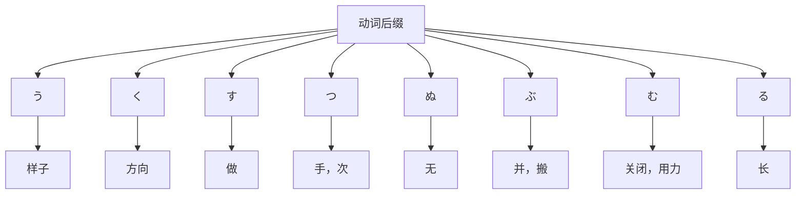

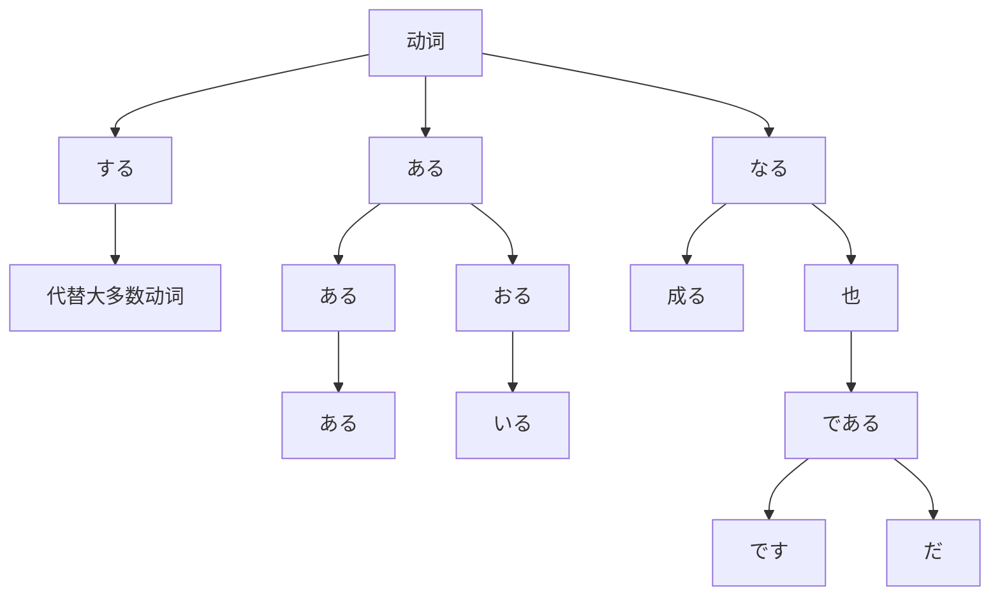

# 基础动词

## 导入

基础动词

- かける・かかる（大面积覆盖）
- つける・つく／つかる（付，着，即，就／浸，渍）
- あてる・あたる（大面积接触／当）

| 给的动词 | 意思 | 记忆         | 敬语                       | 语气                         |
| -------- | ---- | ------------ | -------------------------- | ---------------------------- |
| くれる   | 来   | く → こ → 己 | くださいます「下さる」     | してくれる：给我；为我（好） |
| あげる   | 给   | 上 → 他人    | さしあげます「差し上げる」 | してあげる：简介转述；施舍   |
| もらう   | 拉   | もの → 物    | いただきます「頂く」       | してもらう：请别人；感谢     |

押す／切る／込む／差す／出す／立つ・立てる／突く／取る／乗る／振る／抜く・抜ける／聞く／見る／言う／思う／待つ／詰める・詰まる／上げる・上がる／置く

## かける・かかる（大面积覆盖）

- ソースをかける（浇汁）
- 声をかける（打招呼；问候）
- 迷惑をかける（造成麻烦，给别人带来困扰）
- 造作をかける（造成麻烦，费事）

  - 造作「ぞうさ」费事，麻烦

- 心配をかける（让人担心）
- 賭け事「かけごと」赌博

  - 賭ける「かける」赌，赌博
  - 賭けをする（打赌）
  - ギャンブル［gamble］
  - 博打「ばくち」赌博，赌钱

- 駆ける「かける」跑，快跑
- 駆けつける「かけつける」赶到

  - みんなに先駆ける「さきがける」

- 掛け合いをする（交谈，商谈）

  - 掛け合い「かけあい」交涉，谈判

- かけ替えのない存在（无可替代的存在）

  - 掛け替え「かけがえ」代替的东西

- 〜にかかりきりです（只顾做，一直做）
- かかりつけの病院（常去的医院）
- 掛り付け「かかりつけ」
- 電話をかけまくる（到处打电话）
- 掛け捲る「かけまくる」
- 言い捲る「いいまくる」
- 走り捲る「はしりまくる」到处跑
- かけ引きをする（做交易）
- 駆け引き「かけひき」策略；手腕
- 押しかける（蜂拥而至；不请自来）

  - 殺到「さっとう」纷纷来到，蜂拥而至

- 詰めかける・押し寄せる（蜂拥而至）

  - 詰める「つめる」塞满

- 引っかかる「ひっかかる」挂，卡；不合适，不融洽

  - たこが電線に引っかかる。

- 違和感がある「いわかん」

  - 違和感を覚える（不对劲）

- 語りかける「かたりかける」叙述

  - 述べる「のべる」叙述

- 話しかける（搭讪，搭话）
- 呼びかける（呼吁）
- 政府は市民に節水を呼びかけた。
- 手がける（亲自，亲手）
- 言いがかりをつける（找茬儿）
- 持ちかける（提出话题）
- ～かける（做了一半没有做完／差点儿）

  - 食べかけのご飯
  - やりかけの仕事
  - 忘れかける（差点忘）

- 失いかける（差点丢失）

  - 失う「うしなう」丢失
  - 見失う「みうしなう」迷失

- 駆け込む「かけこむ」跑进去

  - 駆け込み乗車（临时冲刺上车）

- 病院に駆け付ける（急忙赶往医院）
- そばに駆け寄る（急忙跑向某人的身边）

## つける・つく・つかる

- 醤油を付ける（加酱油）

  - ポン酢

- 注文をつける（提出要求，希望）
- 決着をつける（做个了断）

  - 決着「けっちゃく」了结，了断

- 痛めつける（教训，给以严重打击）

  - 教訓「きょうくん」教训

- 聞きつける（偶尔听到）

  - 責任を擦り付ける「なすりつける」找借口

- 〜の言い付けをしっかり守る（吩咐）

  - 言い付け「いいつけ」吩咐，命令

- 申し付ける「もうしつける」吩咐

  - なんなりとお申し付けください（请毫不犹豫地告诉我您需要什么）
  - なんなりと（任何东西，不论什么）

- 買い付けの店（常去的商店）
- 突きつける（不容分说地摆到面前）

  - 要求が突きつけられた（有要求被强行提出）

- 作りつけの棚（固定的架子）
- 人に押し付ける（强加于人）
- 人に纏わり付く（纠缠）

  - 纏わり付く「まとわりつく」纠缠在一起
  - 纏わる「まつわる」纠缠
  - 付き纏う「つきまとう」纠缠；缠住

- 決めつけるのはよくない（武断地判断是不好的）

  - 決めつける「きめつける」片面断定；指责

- 叱りつける（劈头盖脸地批评）
- 浮ついた気持ち（浮躁的心情）

  - 浮つく「うわつく」浮动，忘乎所以；轻浮

- 心に焼き付く（铭刻在心）

  - 焼き付ける

## あてる・あたる（大面积接触／当）

- 当てこする（指桑骂槐）
- 当て付ける（讥讽；讽刺；指桑骂槐）冗談めかして当て付けを言う。
- 探し当てる（到处寻找）
- 割り当てる（分摊分配）

  - 割り当て（分配，分摊）

- 当たり障る「あたりさわる」妨碍；冒犯

  - 障る「さわる」妨碍；有坏影响
  - 目に障る（碍眼）
  - 耳に障る（难听）
  - 気に触る（惹怒）

- 日当たり「ひあたり」采光

  - 日差し「ひざし」阳光照射

- 口当たり「くちあたり」口味

  - 口当たりがいい・悪い・円やか
  - 円やか「まろやか」口味柔和
  - 歯応え「はごたえ」
  - 舌触り「したざわり」
  - 喉越し「のどごし」
  - 口触り「くちざわり」食物进入口中的感觉
  - 口どけ「くちどけ」食物在口中融化的感觉

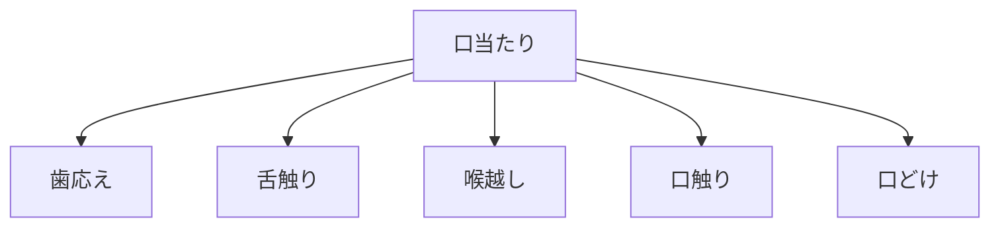

- 人当たり「ひとあたり」待人

  - 人良し「ひとよし」老好人

- 八つ当たり「やつあたり」乱发脾气

  - 父は事業に失敗し、昼間から酒を飲み周囲に八つ当たりするようになった。

- 紛れ当たり「まぐれあたり」歪打正着

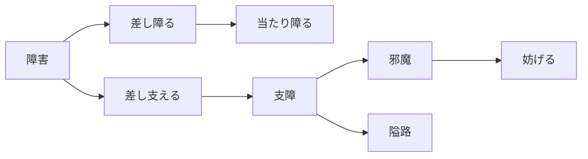

- 障害「しょうがい」障碍；残疾
- 差し支える「さしつかえる」妨碍，障碍
- 差し障る「さしさわる」障碍，阻碍
- 当たり障る「あたりさわる」妨碍；冒犯
- 支障「ししょう」机械故障；障碍
- 邪魔「じゃま」妨碍，阻碍；搅扰，打搅
- 隘路「あいろ」难关；瓶颈
- 妨げる「さまたげる」妨碍，阻挠

## おす

押す・推す「おす」

- 押し屋「おしや」推进拥挤列车的工作人员
- 後押し（后援）
- 一押し「いちおし」主打商品（一番のお勧め）
- ダメ押し（再三叮嘱）
  - 駄目「だめ」不行；（围棋盘上的）单官
  - 碁「ご」
  - 一目を置く（略逊一筹 ← 围棋中弱的一方先下棋）
  - 会社では一目置いた存在だ。

## きる

切る／切れない（完全／不完全）

- 言い切る（说死，断定）

  - 言い切れない（无法说）

- 食べ切れない（吃不完）
- 覚え切れない（记不完）
- 信じ切れない（不能完全相信）
- 貸し切り「かしきり」包租，整租（車、温泉）

  - 柵「さく」

- 締切「しめきり」截止日期（〆切）

  - 締める「しめる」勒紧，系紧
  - きゅうりを締める（腌黄瓜）

- 付き切りの看護（全天候看护）
- 計画を打ち切る（中止する）
- 未練を断ち切る（斩断情丝）

  - 未練「みれん」依恋，恋恋不舍
  - しつこく頼まれる（被人反复强烈地请求）
  - 断ち切れない（无法断绝）

- 仕事を切り上げる（工作告一段落）
- 切りがいい（时机恰当）

  - 切りが悪い（时机不好）

- 足切り試験（资格淘汰考试）

  - 足切り「あしきり」（升学考试等）淘汰规定分数线以下的考生

- 思い切り → 痛快地，尽情地

  - 思い切って → 下决心
  - 思い切った → 果断的

- 掛り切り（专门做）今日本語に掛り切りです。
- 身を切られるほど辛い（切身之痛）
- 世界切っての学者（首屈一指的）

  - 指折りの～「ゆびおりの」屈指可数的
  - 世界屈指の～「せかいくっしの」世界顶尖的

- 相手を切りつける発言（咄咄逼人的发言）

  - 〜を控える（减少）
  - ずけずけ言う（直言不讳）

- 見切りをつける（断然放弃）

  - 見切り「みきり」断念，放弃
  - 諦める「あきらめる」放弃
  - 断念「だんねん」

- 踏ん切りが悪い（优柔寡断）

  - 踏み切り「ふみきり」公路与铁路交叉点；下决心
  - 踏ん切り「ふんぎり」下决心
  - 踏み切りをつける（下决定）

- 実施に踏み切る（果断地付诸于实施）

## 込む

込む ① 包含 ②（后缀时）特别

- 手が込んでいる（精致）

  - 手が込んだ（精致的）

- 道が混む（道路拥挤）

  - 電車の中が混む（电车里很拥挤）
  - すごいラッシュ［rush］

- 心を込めて（全心全意地）

  - 愛情を込めて（充满爱意地）
  - 力を込めて（用力地）

- 人の家に上がり込む（闯入人家）
- 駆け込み乗車（发车时急忙赶上车）

  - 駆け下りる「かけおりる」跑下来

- 列に割り込む「れつにわりこむ」插队

  - 最後尾「さいこうび」队列的最后
  - 最後「さいご」最后

- 洗濯物を取り込む（收衣服）

  - 洗濯物「せんたくもの」
  - 取り込む ① 收进 ② 忙乱

- じっくり煮込んだカレー（慢煮咖喱）

  - じっくり（慢慢地）
  - 煮込む「にこむ」炖，熬
  - 煮詰める「につめる」（把汤汁）煮干，熬干

- 内容・機能を盛り込む（加入内容・功能）

  - 盛り込む「もりこむ」盛上；加进

- 研究にのめり込む（原本没有兴趣，后来逐渐沉迷于研究）

  - のめり込む「のめりこむ」原本没有兴趣，后来逐渐沉迷于

- 研究に打ち込む（埋头于研究）

  - 没頭「ぼっとう」埋头于，专心致志
  - 勉強に没頭する。

- 自分を売り込む（推销宣传自己）
- 自分を追い込む・追い詰める（逼自己）
- 落ち込む（意志消沉）
- 思い込む（深信；想得太多）

  - 思い過ごし「おもいすごし」过虑，考虑过多

- 警察の聞き込み調査（盘问）

  - 取調室「とりしらべしつ」审讯室
  - 査問「さもん」查问，盘问
  - 尋問「じんもん」讯问；盘问

- 着込む（穿得厚实）
- 忍び込む・潜り込む（偷偷进入）

  - 忍び込む「しのびこむ」悄悄进入；埋伏
  - 潜り込む「もぐりこむ」悄悄进入；潜入

- 知識を詰め込む（硬灌）

  - 缶詰「かんづめ」罐头

- 今取り込んでいます（此时正忙）
- 飲み込みが早い（领会能力强）
- 冷え込む「ひえこむ」气温骤降
- 〜が持ち込んだ話（某人提出的话题）
- 突っ込みようがない（无从指责）

  - 突っ込む「つっこむ」深入探讨

- 〜に引き込まれる（被深深吸引）

  - ～に惹かれる（被吸引）
  - 〜に魅せられる（不由得被吸引）

- 警察の張り込み（蹲点儿）
- 意気込む「いきごむ」精神百倍，振奋

  - 張り切る「はりきる」干劲十足

## 差す

| 词汇                   | 意思           | 备注                                       |
| ---------------------- | -------------- | ------------------------------------------ |
| 仕事を差し置く         | 搁置应该做的事 |                                            |
| 警察に差し押さえられた | 扣押，査封     |                                            |
| 差し入れを持っていく   | 慰劳，慰问     | 労る「いたわる」体恤``労う「ねぎらう」慰劳 |
| 外出を差し止める       | 强烈禁止       |                                            |
| 手を差し伸べる         | 伸出帮助之手   |                                            |
| 手数料を差し引く       | 扣除，减去     |                                            |
| 申込書を差し出す       | 提出する       | 届ける「とどける」提交文件``届けを出す     |

## 出す

出す（出／开始）

| 词汇             | 意思                     | 备注                           |
| ---------------- | ------------------------ | ------------------------------ |
| 言い出す         | 开始说                   |                                |
| 雨が降り出した   | 雨开始下                 |                                |
| 子どもを誘い出す | 骗出去                   | 誘う「さそう」劝诱，邀请；引诱 |
| 真相を聞き出す   | 询问出真相               | 真相「しんそう」               |
| 話を切り出す     | 开始说话                 |                                |
| 対応に乗り出す   | 积极参与                 |                                |
| 泥沼から抜け出す | 走出困境                 | 泥沼「どろぬま」泥坑；困境     |
| 逃げ出す         | 逃走                     |                                |
| 呼び出す         | 叫出来                   |                                |
| 割り出す         | 基于各种材料大致得出结论 |                                |

## 立つ・立てる

立ち（接头词／正式）

| 词汇             | 意思                   | 备注           |
| ---------------- | ---------------------- | -------------- |
| 立ち合う         | 作为证人或监督人在场   | 警察の立ち会い |
| 立ち入り禁止     | 进入                   |                |
| 立ち去る         | 「たちさる」走开，离去 |                |
| 研究室に立ち寄る | 顺路到                 |                |
| 立ち食い         | 「たちぐい」站着吃     |                |
| 立ち読み         | 站着读                 |                |

立つ（结尾词／立；高）

> 名词+立つ → だつ
> 动词+立つ → たつ

| 词汇     | 意思                                 | 备注                     |
| -------- | ------------------------------------ | ------------------------ |
| 泡立つ   | 「あわだつ」起泡                     | 泡立てる                 |
| 苛立つ   | 「いらだつ」因事情不顺利而焦躁烦躁   | イライラする（感到烦躁） |
| 際立つ   | 「きわだつ」显眼，明显               |                          |
| 引き立つ | 「ひきたつ」衬托，分外好看，特别显眼 |                          |
| 目立つ   | 「めだつ」显眼                       | 周りの人より目立つ       |
| 飛び立つ | 「とびたつ」欣喜而雀跃               | 跳ぶ・飛ぶ「とぶ」       |
| 成り立つ | 「なりたつ」成立，谈妥               |                          |
| 腹立つ   | 「はらだつ」生气                     |                          |

立て（立；高）

- 立て替える「たてかえる」垫付钱
- 立て板に水（口若悬河）
- 天子に奉る（献给天子）

  - 天子「てんし」皇上
  - 奉る「たてまつる」奉承；献上

- 立てこもる（闷在房子里）

  - 籠る「こもる」闭门不出；包含

- 人を守り立てる「もりたてる」拥护

  - 会社を守り立てる「もりたてる」振兴公司

- 騒ぎ立てる「さわぎたてる」大事叫嚷
- 意欲・好奇心を掻き立てる

  - 掻き立てる「かきたてる」激起，煽动

- 組み立てる「くみたてる」组装

  - 組み立て式（组装式）

- 仕立てる（精心制作）ワイシャツを仕立てる。
- 責め立てる「せめたてる」严厉斥责
- 花に見立てる（比作）的を敵に見立てて射撃の練習をする。
- 取れたてのイカ（刚捕捞的鱿鱼）

  - 打ち立てのうどん（刚擀的乌冬面）
  - ゆでたてのそば（刚煮好的荞麦面）
  - 焼きたてのパン（刚烤好的面包）
  - 炊き立てのご飯（刚煮好的米饭）

# 核心动词

## 突く

- 不意を突く（出其不意）
- 突き当たりのところ（尽头的地方）
- 真実を突き詰める（追究査明）

  - 真実を突き止める（追究，彻底查明）
  - 物事の本質を突き止める
  - 詰める（深究；塞满；缩小）

- 崖から突き落とす（推下）

  - 崖「がけ」悬崖
  - 生涯「しょうがい」终生
  - 一生涯「いっしょうがい」一生

- やるべきことを突き進んでやる（该做的事赶紧做）

  - 突き進む「つきすすむ」不断前进

- 肌が突っ張る「つっぱる」紧绷，僵硬

  - 引き締まる「ひきしまる」绷紧，紧闭

- 突っ張った若者（虚张声势的年轻人）

  - 年の甲斐がない（不符合年龄的表现）

## 取る

とる「取る・採る・撮る・摂る」

- とりあえず・一応（暂且，姑且）

  - 敢える「あえる」（斗胆）
  - 敢えて言う（冒昧地说）
  - 強いて言えば（如果非要说的话）
  - 強いて「しいて」强迫

- 取りも直さず（原封不动地）→ そのまま
- 取り扱う「とりあつかう」操作；使用；对待

  - 取扱書「とりあつかいせつめいしょ」使用说明书
  - 取扱注意（注意操作）
  - 取扱いが簡単・面倒・面倒くさい
  - 使う「つかう」→ 扱う「あつかう」使用；处理；对待；经营；掌管［deal with］｜子供扱いが上手（擅长对待孩子）
  - あしらう（招待，接待）｜人をあしらう術（处理人际关系的技巧）
  - 操る「あやつる」掌握，灵活运用

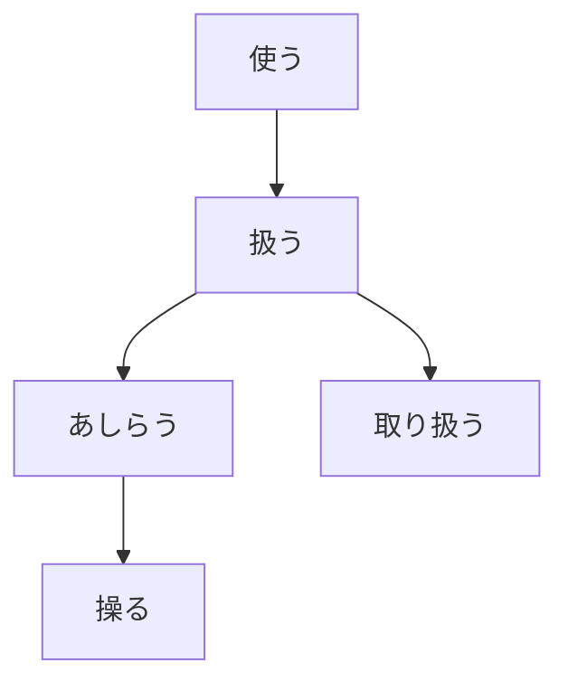

- 意味を取り違える（误解）

  - 間違える「まちがえる」弄错，搞错
  - 誤解「ごかい」误解
  - 勘違い「かんちがい」误会

- 訴訟を取り下げる·撤回する

  - 訴訟「そしょう」
  - 取り下げる「とりさげる」
  - 撤回する「てっかい」撤回
  - 撤去「てっきょ」拆除

- 建物を取り壊す（拆毁）
- 釘を取り外す（取下安装好的东西）

  - 取り外す「とりはずす」摘下，拆下

- 研究に取り掛かる·着手する「ちゃくしゅ」

  - 研究に取り組む（致力于）
  - 研究に専念する（致力于）

- 私たちを取り巻く環境（所处环境）

  - 取り巻く「とりまく」包围

- お取り寄せできます。（调货）

  - 在庫「ざいこ」
  - 在庫切れ

- 取り急ぎご連絡まで。（急忙，赶忙）
- 運動会を取りやめる・中止する・打ち切る
- 電話をお取り次ぎします。（转接电话）
- 研究に取り組む

  - 研究に打ち込む
  - 研究に専念する
  - 研究に励む
  - 研究に没頭する
  - 研究に明け暮れる

- 取締役「とりしまりやく」董事
- 交通違反を取り締まる（管制，取缔）
- 裏を取り調べる（调查，审讯）

  - 取調室

- 予約を取り消す・キャンセルする
- 警察には取り合ってもらえない（警察不会受理）

  - 取り合う「とりあう」理睬

- 拭き取る「ふきとる」擦掉
- 技術を取り入れる（采纳，引进）
- 信用というものは一旦失ったが最後、もう二度と取り戻すことができない。

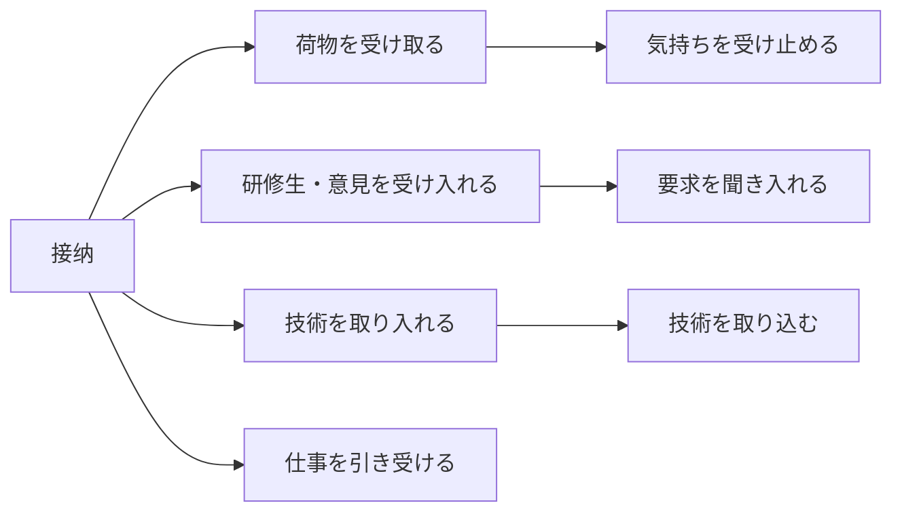

- 荷物を受け取る｜受取人｜小包
- 気持ちを受け止める

  - 現実を受け止める
  - 厳粛に受け止める

- 研修生・意見を受け入れる（接受）
- 要求を聞き入れる（听进去；采纳）

  - 聞き込む（一直听）
  - 聞き入る（听入迷）

- 技術を取り入れる
- 技術を取り込む
- 仕事を引き受ける

## 乗る

- 相談に乗る（给予建议）
- 乗り気が無さ過ぎ（缺乏热情）

  - 無さ過ぎ「なさすぎ」太缺乏，没有
  - 乗り気「のりき」起劲，感兴趣；配合

- 乗り換えが簡単・面倒・面倒臭い（电车换乘）
- 調査に乗り出す（积极；出头露面）

## 振る

- 手を振る（挥手）
- 学者のふりをする（装成学者）

  - ～ふり（装～的样子）
  - 澄ましたふりをする（装正经）
  - 澄ます「すます」澄清；平心静气
  - 学者ぶる（装成学者）
  - ～ぶる（冒充，假装，摆…的架子）
  - そぶり（样子）
  - 様子「ようす」

- 三年ぶりに再会（时隔三年再次见面）
- 彼女に振られた（被女友甩了）
- 偉そうに振る舞う（表现得很自大）

  - 振る舞う「ふるまう」行动

- 暴力・正義感を振るう（施展暴力／大肆宣扬正义感）

  - 振るう「ふるう」挥动；使用；施加

- 振り回されるのがいや（被摆布）
- ふりかけ（拌饭料）
- 力を振り絞る（竭尽全力）

  - 絞る「しぼる」拧，绞
  - お絞り「おしぼり」湿毛巾
  - お水・お冷「おひや」

- 手を振り払う（甩开）
- 仕事を三人に振り分ける（分配）
- 振り返ってみると（回顾，回头看）
- 銀行口座に振り込む（转账）

  - 銀行口座に振り替える（转账）
  - 振り込み詐欺（转账诈骗）
  - 海外送金

- 頼みを振り切る（坚决拒绝）

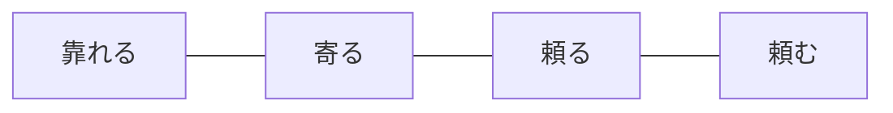

- 振り切る（断然拒绝）

  - きっぱり断る（痛快拒绝）
  - あっさり断る（冷淡拒绝）
  - そっけなく断る（不留情面地拒绝）

    - そっけなく指摘する（不留情面地提出批评）

  - やんわり断る（委婉拒绝）
  - 断然断る（坚决拒绝）

## 抜く・抜ける

- 歯を抜く（拔牙）
- 群を抜く（超群）「ぐん」
- 日本人を追いかける（追赶）

  - 日本人に追い着く（追上）
  - 日本人と並ぶ（一样，并行）
  - 日本人を抜く（超越）

- 抜きつ抜かれつして走る（你追我赶）
- 手を抜く（偷工减料）

  - 手抜き（偷懒；偷工减料）

- 髪の毛が抜ける

  - 手袋が落ちる（掉地上）
  - 髪が抜ける（拔掉）
  - 靴が脱げる（脱掉）
  - 落下する「らっか」落下
  - 墜落する「ついらく」掉下来（飞机等）

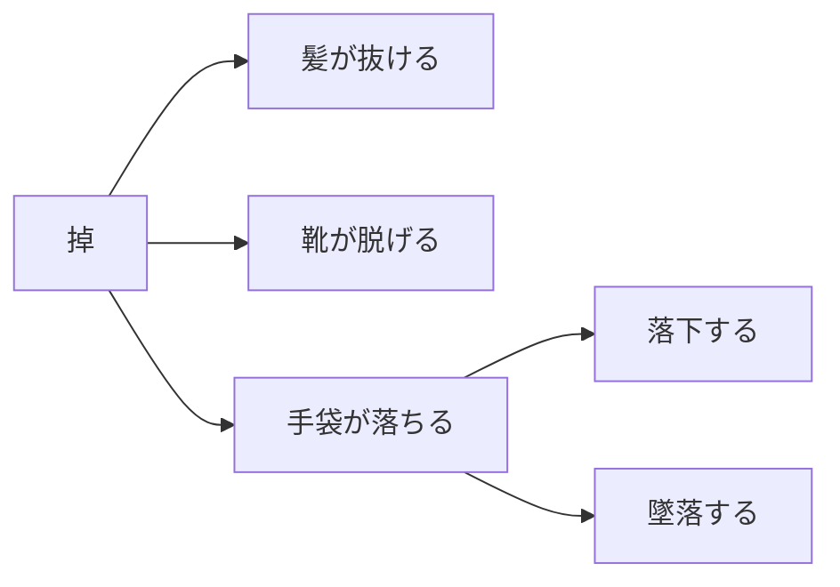

- 生える（长出来［0→1］）カビが生える
- 伸びる（变长，长长）
- 育つ（长大，长高）｜どんどん、ぐんぐん、すかすか、すくすく
- とれる（能长）｜取れたて（刚捕获的）

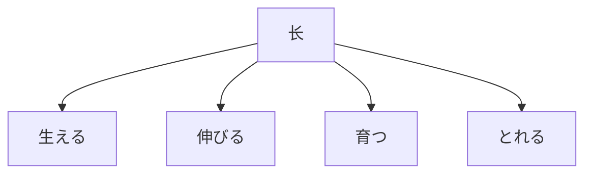

- 字が抜ける（漏写字）

  - 字が抜け落ちる（［难］遗漏）

- 泥沼から抜け出す（走出困境）

  - 人間が一旦社会のどん底に陥ったら、もうそこから抜け出すことがあり得ない。
  - 陥る「おちいる」

- <u>抜かりなく</u>注意する（没有疏忽地／认真地）
- 度胆が抜かれた（吓破了胆）

  - 胆「きも」→ 肝｜肝臓「かんぞう」膵臓「すいぞう」心臓「しんぞう」
  - 肝試し「きもだめし」
  - 度胆「どぎも」胆子

- 抜き打ち／不意打ち（出其不意；突击检查）
- 生き抜く（生存下来；活下来）
- 追い抜く（超过）
- 勝ち抜く（胜出）
- 困り抜く／困り果てる（极度困扰）
- 信念を貫く（贯彻，坚持信念）

  - 貫く「つらぬく」贯彻

- 最後までやり抜く（坚持到最后完成）
- ごぼう抜き（一口气跑步超过几个人）

  - ごぼう（牛蒡）

- 灰汁が抜ける（脱俗）

  - 灰汁「あく」杂质；执拗，生硬；俗气

- 気が抜ける（泄气）
- 腰が抜ける（吃惊而瘫坐在地）
- 膝が抜ける／膝が笑う（腿软，发抖）

## 聞く

- 「きく」

  - 聞く・聴く → 他动词
  - 効く・利く → 自动词
  - 右利き／左利き（右撇子／左撇子）
  - 口が利く（能说会道）

- 聞き覚えがある（听起来熟悉）
- 聞き入る（聚精会神地听）
- 聞き惚れる（听得入迷）

  - 惚れる「ほれる」入迷，欣赏

- 指摘を聞き入れる（接受批评）
- 盗み聞きする（偷听）

  - 盗む「ぬすむ」偷盗

- 聞き違い（听错）
- 聞き耳を立てる（洗耳恭听）
- 聞き応えがある（值得一听）

  - 手応え「てごたえ」值得一做
  - 歯応え「はごたえ」嚼头

- 聞き上手な人／聞き下手「ききべた」（善于倾听的人／不擅长倾听）

  - 訴える「うったえる」诉说

- 聞き漏らしたかもしれませんが、（可能我没听漏了，但是…）
  聞き漏らす「ききもらす」听漏
- 大事なことを聞き逃す（听漏，错过）
- 忠告を聞き流す（当耳边风）
- 聞き取れない（［客观］听不清，听不见）

  - 聞きづらい（难听）

- 聞き慣れた言葉（耳熟能详的，听惯了的）
- 聞き手（听者）

  - 話し手（说者）
  - 読み手（读者）
  - 書き手（作者）
  - 大手「おおて」

- 話を聞き分ける（区分不同）

  - 聞き分けが上手（擅长辨别）
  - 聞き分けが悪い（不听劝）

## 見る

- 現実を見据える（目不转睛地看／看清）

  - 据える「すえる」放置，安置
  - 座る「すわる」坐

- 見損なう （看错人）

  - 〜損なう「そこなう」没成功，失败；…错
  - なり損なう（没有当成）｜言い損なう（没有说成）

- 見覚えがある（见过有印象）
- 見当違い（判断，推测，估计错误）

  - 見当「けんとう」目标；方位
  - 見当外れ（判断失误）

- 見応えがある（值得一看）
- 今が見どころ（现在是精彩之时）
- 見え透いたうそ（显而易见的谎言）

  - 見え透く「みえすく」看透，看穿，显而易见
  - 見え透いたうそを抜け抜け言う（厚颜无耻地说着显而易见的谎言）
  - 抜け抜け（厚颜无耻地）
  - ずけずけ（直言不讳地）
  - わざと（有意地）

- 見栄を張る（爱面子，装门面，显摆）
- 見え見え（不言自明）

  - 露骨「ろこつ」露骨，直率，明显

- 見た目（好像；看上去）

  - 見かけ（外貌，看起来）

- 人は見かけによらぬ（人不可貌相）
- 見ず知らずの人（素不相识的）
- 見せかけ（假象；显摆）

  - 見せかける（显摆）

- 見上げる（仰望；尊敬）

  - 見下げる（俯瞰；轻视）
  - 見下ろす（轻视）
  - 人を見下す・見下げる・見下す（轻视他人）

- 悪いことを見過ごす（视而不见）

  - 見逃す「みのがす」看漏，没看见

看不起，鄙视

- 見下ろす「みおろす」从高处向下看
- 見下げる「みさげる」轻视
- 見下す「みくだす」轻视、蔑视
- 見くびる「みくびる」小看
- ばかにする（当傻子）
- 卑しめる「いやしめる」鄙视
- 侮る「あなどる」轻视

  - 侮れない存在（不能小看的）

- 軽蔑する「けいべつ」轻蔑
- 〜を〜蔑ろにする

  - 蔑ろ「ないがしろ」轻视

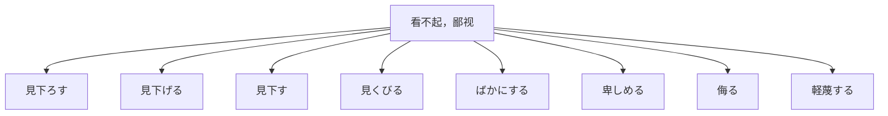

- 見慣れた風景（看惯的）
- 見惚れる（看入迷）
- 見初める「みそめる」一见钟情

  - 一目惚れ「ひとめぼれ」一见钟情
  - 初対面「しょたいめん」

- 見込みがある（有可能，有前景）
- 見通しが立たない（无法预测）

  - 先が見えない（前途未卜）
  - 先を見通す（展望未来）

- 人を見習う（模仿学习）
- 本の見出し（索引）
- お見合い（相亲）
- 見晴台「みはらしだい」观景台

  - 展望台

- 見渡す限り（所见之处）
- その案を見送る（暂不采用）
- 見極める（好好审视，准确评估）

  - 本質「ほんしつ」

- 見張る（みはる）守望，警戒
- 見破る／見抜く「みやぶる」识破，看穿
- あまり見受けない人（不多见的人）

## 言う

- 昔の言い伝え（传说，老话）

  - 伝える「つたえる」传递

- 親の言いなりになる（听从）

  - 言いなり（唯命是从，百依百顺）

- 言い訳する／言い逃れる（找借口）

  - 言い訳「いいわけ」借口，辩解
  - 理「ことわり」理由，道理
  - 言訳「ことわけ」辩解
  - 言い逃れ「いいのがれ」借口

- 女の言い分（女人的说辞／借口）

  - 申し分「もうしぶん」辩解的理由
  - 言い分「いいぶん」口头禅（口癖）→ 不満、愚痴

- 有無を言わさず（不容分说）

  - 有無「うむ」有无
  - 要求を突き付ける（提出强硬的要求）
  - 無理やり「むりやり」强迫，强硬

- 言い換えれば（换句话说）
- 言いそびれる／言い損なう（错失说的机会）
- 言い退ける「いいのける」说话噎对方；回绝

  - 退く「しりぞく」退出；退职
  - 退ける「しりぞける」拒绝；免职；使退出

- 言い逃れ（搪塞；借口）
- 言い切る（断言）

  - 言い切れない（无法断言）

- 言い辛い「いいづらい」难以启齿
- 言い争い「いいあらそい」口角；争吵

  - ロ喧嘩「くちけんか」口角；争吵
  - ロ論「こうろん」口角；嘴上理论
  - 揉め事「もめごと」纠纷，麻烦

- 噂を言い触らす／撒き散らす（散布流言）

  - 言い触らす「いいふらす」到处说
  - 撒き散らす「まきちらす」散布

- 判決が言い渡された（宣告）

  - 判決「はんけつ」判决

## 思う

- 思い出す（回忆起来）

  - 思い着く（想到）
  - 思い当たる（想起可能的事情）

- いっぱい思い出を作る（回忆）
- 思い違い／思い過ごし／思い込み（误解，错误的认识）
- 思いやりがある（关怀，体谅，同情，体贴）
- 思い掛けないこと（意外的）
- 思い悩む「おもいなやむ」苦恼
- 思い切り遊ぼう（痛快地，尽情地）=思う存分に=存分に

  - 思い切って言い出した（鼓起勇气说）
  - 思い切った行動（果断的）

- しみじみ思う（切身感受；深刻思考）

  - 染みる「しみる」渗；深深感受（身に染みるほど）
  - 切々思う「せつせつ」
  - つくづく思う
  - ひしひし思う

## 待つ

- 待ちに待つ（等了又等）
- 待ち惚け「まちぼうけ」等得发呆
- 待ち遠しい「まちどおしい」盼望已久的
- 待ち焦がれる「まちこがれる」焦急地等待
- 待ちくたびれる（等得累了）

  - くたびれる（疲劳）

- 待ち受ける／待ち構える（做好准备等待）

  - 災いが待ち受けている「わざわい」不祥之兆即将到来

- 待ち望む（盼望）
- 待ち暮らす（终日等待）
- 待ち伏せる（埋伏）
- 待ち合わせる（等人）

  - 待ち合わせですか。（在等人吗？）

## 詰める・詰まる

- 追い詰める（逼迫）
- 思い詰める（钻牛角尖）

  - 問い詰める（追问／盘问）
  - 詰問「きつもん」质问

- 煮詰める（彻底地推进想法或企划；使熬干）

  - 煮詰まる（接近下结论或解决的阶段；熬干）味噌汁が煮詰まっている

- 計画が行き詰まる「ゆきづまる」搁浅；行不通
- 最後まで突き詰める（追究到底）

## 上げる・上がる

- 出来上がる（做完）

  - 作り上げる（昨晚，造完）

- 思い上がる（骄傲／自大）

  - 膨れ上がる「ふくれあがる」飘飘然
  - 舞い上がる「まいあがる」兴高采烈；飘飘然

- 成り上がり者（暴发户）
- 事実を捏ち上げる「でっちあげる」捏造事实
- 打ち上げ（庆功宴）

  - 宴「うたげ」
  - 宴会「えんかい」

## 置く

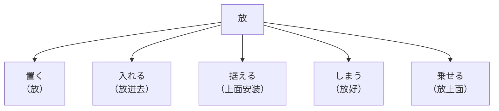

- 念頭に置く（放心上）
- 〜を置き去りにする「おきざり」撇下不管
- 置き手紙して（留下便条）
- 置き忘れる（遗忘）
- 価格は据え置きです（暂时不做变动）
- 客の苦情を差し置く（搁置该做的事）
  - 上司を差し置いて決める（越过不该越过的人）

## する

- 準備する → 準備が整う → 備える

  - 整う・整える
  - 備える・備わる
  - 地震への備えが必要

- 心配する → 心配を抱く → 心配を抱える

  - 不安がある → 不安を抱く → 不安を抱える
  - 問題がある → 問題を抱く → 問題を抱える
  - 抱く「いだく」心怀
  - 抱える「かかえる」心怀；抱

- 成功する → 成功を遂げる

  - 発展する → 発展を遂げる
  - 遂げる「とげる」完成，达到
  - 遂に「ついに」终于

- 仕上がりが重厚（装潢有气派庄重）
- 論文の仕上げ（论文的完成）

  - 仕上げはいつになるでしょうか。（完成时间是什么时候？）

- 部屋の仕切り（房间的隔断）

  - 仕切り屋（收废品的）

- 毎月の仕送り（每月的汇款）
- 子どもを躾ける（教育孩子）

  - しつけが悪い（教养不良）

- パスタのソース仕立て（采用特定酱汁的意大利面）
- 仕打ちが冷たい（对人的态度）
- 天然水 100%仕込み（装入／酿造）

  - 醸す「かもす」酿造

- 仕入値段（进货价格）
- 喧嘩を仕掛ける（主动做）
- 〜ように仕向ける（努力让〜）

  - 部下がもっと積極的に仕事に取り組むように仕向けるために、上司は様々なモチベーション向上の工夫を凝らしました。

- 仕掛け（装置）
- 仕掛け人（主谋）
- 二人が仕組んだ誘拐（策划）

  - 会社の仕組み（组织机构）

- 彼の仕業「しわざ」勾当
- 仕種「しぐさ」作派

  - 江戸仕種（江户时代的作派）

## ある＆なる

- 才能がある

  - → 才能が備わっている
  - → 才能を備える

- 成り行き（趋势）
- 成り立つ（成立）
- 一人前の先生になりきっている（完全变成）

## まくる・めく

- 「まく」

  - 巻く（卷，包裹）
  - 撒く（撒，散布）
  - 播く（播种）
  - 蒔く（播种）

- ページを捲る「めくる」翻页 → 小

  - 袖を捲る「まくる」卷起袖子 → 大

- 言いまくる（到处说）

  - しゃべりまくる（喋喋不休）
  - 電話をかけまくる（到处打电话）
  - 書きまくる（疯狂地写）
  - 北風が吹きまくる（北风猛吹）

- 蠢く「うごめく」蠢蠢欲动
- 星が煌めく「きらめく」闪烁

  - キラキラ

- いい考えが閃く「ひらめく」闪现
- 会場が犇めく「ひしめく」蜂拥而至
- 春めく（像春天）
- 古めいた装飾（古色古香）

  - 古めかしい（古色古香）

## 紛れる

紛れる「まぎれる」分散

- 気紛れ「きまぐれ」反复无常
- 気を紛らす「まぎらす」转移注意力
- 紛らわしい（容易混淆的／扯不清）
- 紛れもない事実（明摆着的事实）
- 悔し紛れ「くやしまぎれ」肠子都悔清了
- 紛れ当たり「まぐれあたり」歪打正着

## 其它（理解・积累・努力）

- 理解

  - 分かる（明白）
  - 知る（知道）
  - 体得「たいとく 」体会
  - 心得る「こころえる」懂得
  - 悟る「さとる」知晓
  - 察知「さっち」察觉
  - 会得「えとく」领会｜会釈「えしゃく」点头打招呼
  - 飲み込み「のみこみ」接受

- 积累

  - 経験を積む
  - 年齢を重ねる
  - 努力を積み重ねる
  - 雪が積もる

- 努力

  - 絶えざる努力「たえざる」不懈地
  - 惜しまない努力「おしまない」不惜力
  - 努めて〜「つとめて」
  - 精進する「しょうじん」修行
  - 仕事をてきばき／ばりばりこなす（干脆利落）
  - 手際よく仕事する（有巧劲地）
  - こつこつ／こまめに／まめに働く（孜孜不倦，勤勤恳恳）

- 斟酌，推敲

  - 入念する「にゅうねん」
  - 念入り／心を込めて／心のこもった
  - 推敲する「すいこう」
  - 吟味する「ぎんみ」
  - 練る「ねる」
  - 考え練る
  - 練り直す（反复推敲）
  - 究める「きわめる」钻研
