# 形容词

## 用法

- 形容词

  - い → 词尾和结尾
  - し → 古语形容词的结尾；「よし」
  - き → 古语形容词的词尾；「べき」

- 形容动词：か、やか、らか

  - 没有这些后缀 → 长得像名词

- 形容动词修饰名词：な、なる、たる

  - 大事なること → 大事なこと
  - 確たる証拠 → 確実な証拠

- 副词：に、く、と
- 拟声词拟态词：する、なる

## 可爱的

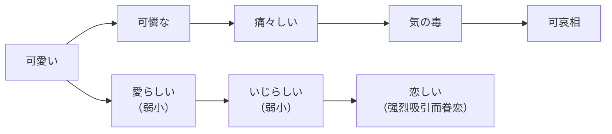

可愛い「かわいい」可爱

- 可憐な「かれんな」楚楚动人

  - 痛々しい「いたいたしい」令人心疼
  - 気の毒「きのどく」遗憾
  - 可哀相「かわいそう」可怜

- 愛らしい「あいらしい」惹人喜爱

  - いじらしい「いじらしい」令人怜爱
  - 恋しい「こいしい」（强烈吸引而眷恋）思念的，怀念的

## 美丽的

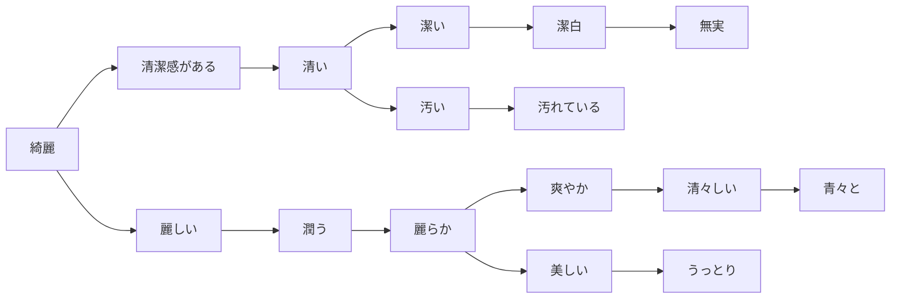

綺麗「きれい」

- 清潔感がある「せいけつかん」

  - 清い「きよい」清澈的
  - 潔い「いさぎよい」干脆，爽快
  - 潔白「けっぱく」清白的
  - 無実「むじつ」无辜的
  - 汚い「きたない」脏的
  - 汚れている「よごれている」弄脏了的

- 麗しい「うるわしい」美丽的

  - 潤う「うるおう」润
  - 麗らか「うららか」风和日丽的，晴空万里的
  - 爽やか「さわやか」清爽的
  - 清々しい「すがすがしい」清新的
  - 青々と「あおあおと」绿油油的
  - 美しい「うつくしい」
  - うっとり（陶醉；发呆）

## 可贵的

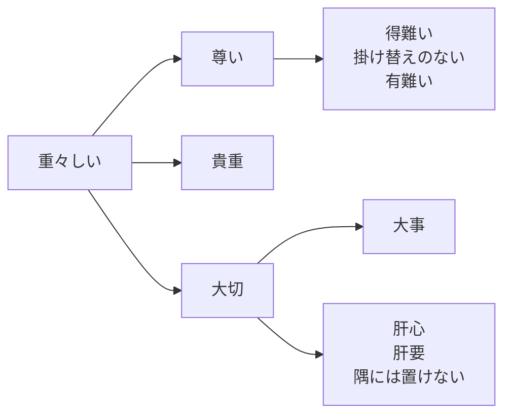

- 重々しい「おもおもしい」
- 尊い「とうとい」尊贵的，珍贵的

  - 得難い「えがたい」难得的
  - 有難い「ありがたい」值得感谢的
  - 掛け替えのない（无可替代）

- 貴重「きちょう」贵重
- 大切「たいせつ」重要

  - 大事「だいじ」重要
  - 肝心「かんじん」关键，核心
  - 肝要「かんよう」关键，重要
  - 隅には置けない（不可忽视，举足轻重）

## 可怕的

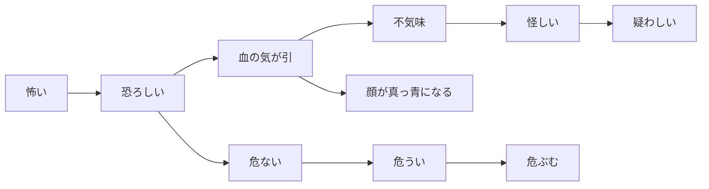

- 怖い「こわい」可怕的
- 恐ろしい「おそろしい」恐怖的

  - 危ない「あぶない」危险的
  - 危うい「あやうい」危险的
  - 危ぶむ「あやぶむ」担心

- 血の気が引く「ちのけがひく」脸白

  - 不気味「ぶきみ」阴森的
  - 怪しい「あやしい」可疑的；不靠谱的
  - 疑わしい「うたがわしい」可疑的｜疑う「うたがう」

- 顔が真っ青になる「まっさお」脸色铁青

## 可恨的

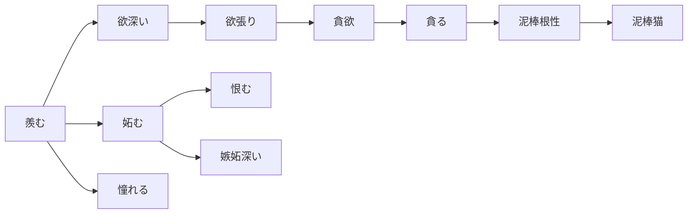

- 羨む「うらやむ」羡慕

  - 妬む「ねたむ」嫉妒
  - 恨む「うらむ」怨恨
  - 嫉妬深い「しっとぶかい」嫉妒心重
  - 恨めしい「うらめしい」可恨的
  - 憎む「にくむ」怨恨｜憎い、憎たらしい

- 欲深い「よくぶかい」贪婪的

  - 欲張り「よくばり」贪心
  - 貪欲「どんよく」贪婪
  - 貪る「むさぼる」贪婪地索取
  - 泥棒根性「どろぼうこんじょう」小偷本性
  - 泥棒猫「どろぼうねこ」喜欢偷窃的人｜すり

- 憧れる「あこがれる」向往

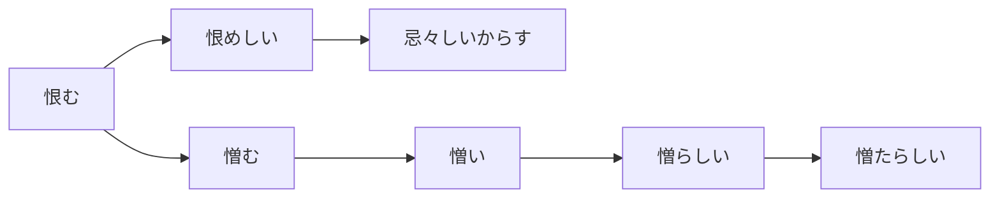

- 恨む「うらむ」怨恨

  - 恨めしい「うらめしい」可恨的
  - 忌々しいからす「いまいましい」讨厌的乌鸦

- 憎む「にくむ」憎恨

  - 憎い「にくい」可恨
  - 憎らしい「にくらしい」讨厌
  - 憎たらしい「にくたらしい」令人憎恶

## 缜密的

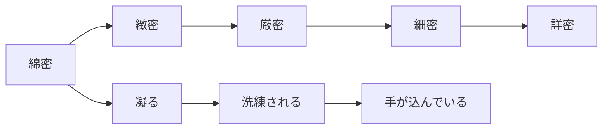

- 綿密「めんみつ」细致，绵密

  - 緻密「ちみつ」精密，周密
  - 厳密「げんみつ」严谨
  - 細密「さいみつ」精细｜詳細「しょうさい」
  - 詳密「しょうみつ」详尽

- 凝る「こる」精致，讲究｜凝ったデザイン

  - 洗練される「せんれんされる」优雅，精致
  - 手が込んでいる「てがこんでいる」复杂

## 粗糙的

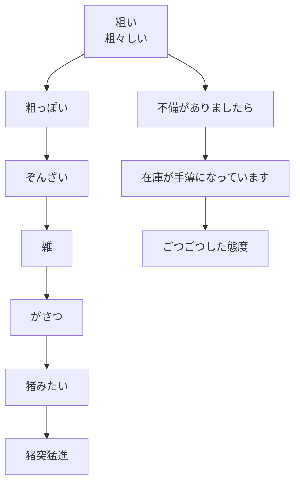

- 粗い「あらい」粗糙的｜荒い「あらい」疯狂的｜狂う「くるう」发狂

  - 粗々しい「あらざいしい」粗野
  - 粗っぽい「あらっぽい」粗暴
  - ぞんざい「ぞんざい」粗鲁

    - 人扱いがぞんざい（对人粗鲁）

  - 雑「ざつ」糙
  - がさつ「がさつ」愣头青

    - 煮え切らない（犹豫不决的，不温不火的）

  - 猪みたい「いのみたい」猛，愣｜猪「いのしし」
  - 猪突猛進「ちょとつもうしん」勇往直前

- 不備がありましたら「ふび」如果有疏漏

  - 在庫が手薄になっています「てうす」库存不足
  - ごつごつした態度（粗鲁的态度）

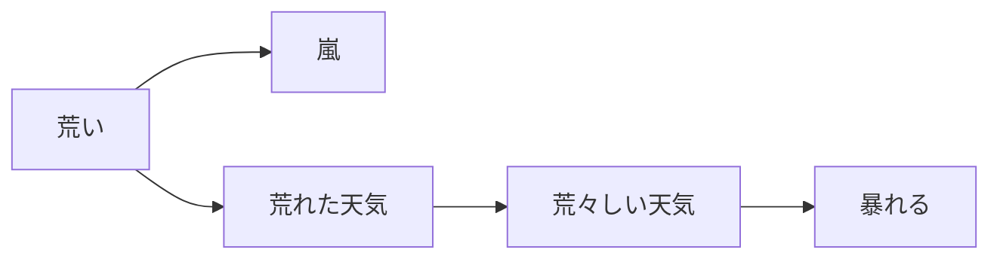

- 荒い「あらい」疯狂的

  - 嵐「あらし」暴风雨｜京都の嵐山

- 荒れた天気「あれた」恶劣天气

  - 荒々しい天気「あらあらしい」狂暴天气
  - 暴れる「あばれる」乱闹；暴动

## 严的

- 厳しい「きびしい」严格
- 甘い「あまい」甜；幼稚的；宽松的
- 現実を甘く見る「げんじつをあまくみる」低估现实
- 甘い汁を吸う「あまいじるをすう」占便宜，不劳而获
- ほんのり甘い「ほんのりあまい」轻微甜

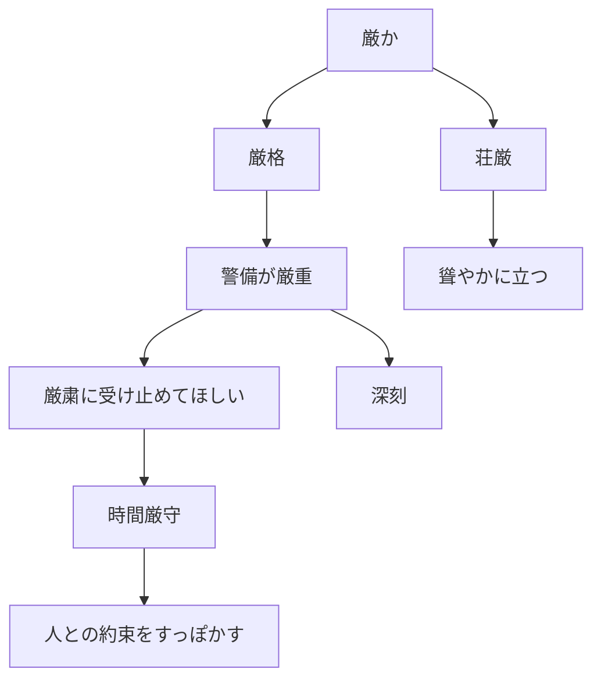

- 厳か「おごそか」庄严，肃然

  - 厳格「げんかく」严格
  - 警備が厳重「げんじゅう」安保森严
  - 深刻「しんこく」严重
  - 厳粛に受け止めてほしい「げんしゅく」希望严肃对待
  - 時間厳守「じかんげんしゅ」严守时间
  - 人との約束をすっぽかす（爽约）

- 荘厳「そうごん」庄严

  - 聳やかに立つ「そびやか」高高耸立

## 明亮的

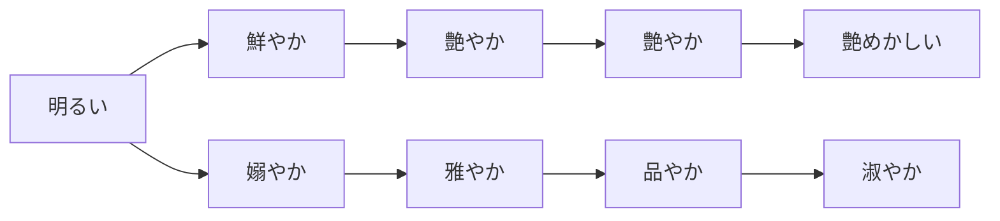

- 明るい「あかるい」明亮的，鲜明的

  - 鮮やか「あざやか」鲜艳的｜あざ（痣，胎记）
  - 艶やか「つややか」有光泽
  - 艶やか「あでやか」艳丽的
  - 艶めかしい「なまめかしい」性感的

- 嫋やか「たおやか」柔美，婀娜

  - 雅やか「みやびやか」优雅
  - 品やか「しなやか」有品味
  - 淑やか「しとやか」温婉，贤淑

## 勇猛的

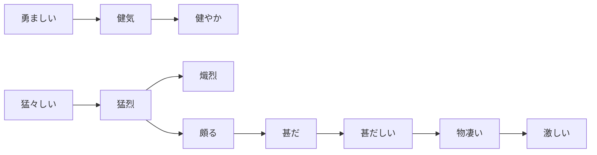

- 勇ましい「いさましい」勇敢

  - 健気「けなげ」（少年，妇女）坚强，顽强
  - 健やか「すこやか」健康｜すくすく（茁壮）｜すかすか（顺利地）

- 猛々しい「たけだけしい」勇猛｜北野武「きたのたけし」

  - 猛烈「もうれつ」猛烈
  - 熾烈「しれつ」激烈
  - 頗る「すこぶる」非常
  - 甚だ「はなはだ」非常
  - 甚だしい「はなはだしい」极度
  - 物凄い「ものすごい」惊人

    - 凄まじい「すさまじい」惊人的

  - 激しい「はげしい」激烈

## 小气的

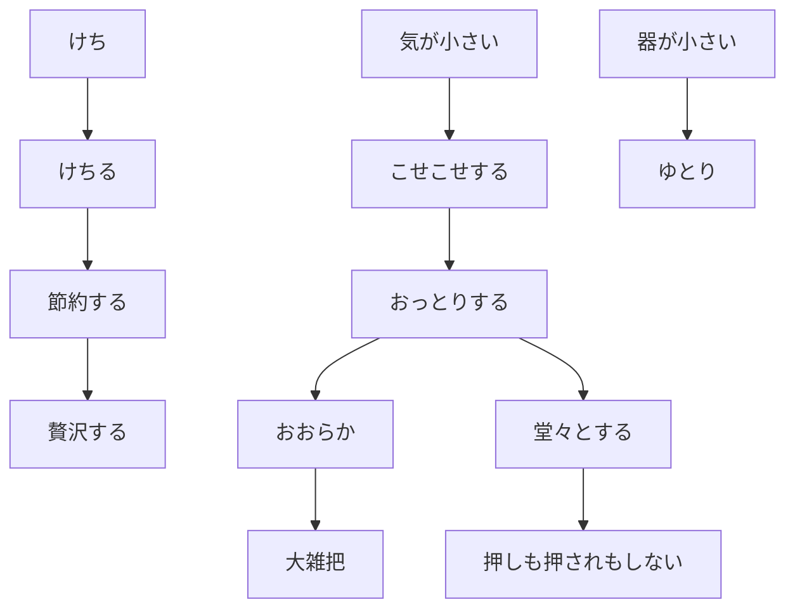

- けち（吝啬）

  - けちる（小气）｜昼飯をけちる
  - 節約する「せつやくする」节约
  - 贅沢する「ぜいたくする」奢侈

- 気が小さい「きがちいさい」小肚鸡肠

  - こせこせする（小气）
  - おっとりする［内］大方
  - 堂々とする「どうどうとする」［外］堂堂正正
  - おおらか（大大咧咧的）
  - 大雑把「おおざっぱ」粗心｜大雑把に言えば

- 器が小さい「うつわ」心胸狭窄

  - ゆとり（宽裕；包容力）
  - 押しも押されもしない（因为有实力）有气魄

## 踏实的

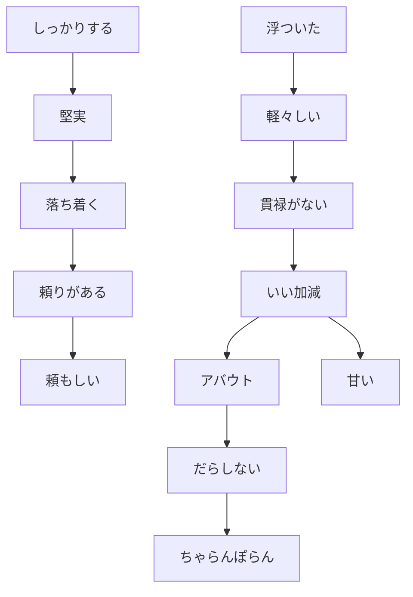

- しっかりする（踏实稳重）

  - 堅実「けんじつ」踏实
  - 落ち着く「おちつく」平静
  - 頼りがある「たよりがある」可靠
  - 頼もしい「たのもしい」令人信赖

- 浮ついた「うわついた」轻浮

  - 軽々しい「かるがるしい」轻率
  - 貫禄がない「かんろく」没有威严，威风
  - いい加減「いいかげん」粗率，马虎
  - アバウト（大致，不细心）
  - だらしない（邋遢）
  - ちゃらんぽらん（吊儿郎当，不严肃）
  - 甘い「あまい」幼稚的

## 优秀的

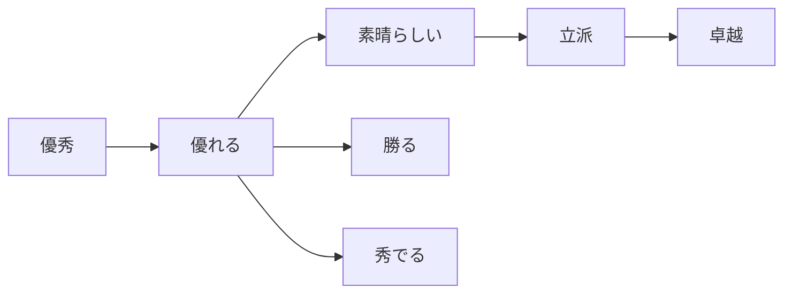

- 優秀「ゆうしゅう」优秀
- 優れる「すぐれる」卓越
- 素晴らしい「すばらしい」精彩，绝妙
- 立派「りっぱ」杰出，优秀
- 勝る「まさる」胜过
- 秀でる「ひいでる」擅长
- 卓越「たくえつ」卓越
- 抜群「ばつぐん」卓著
- 抜きん出る「ぬきんでる」拔尖

## 小的

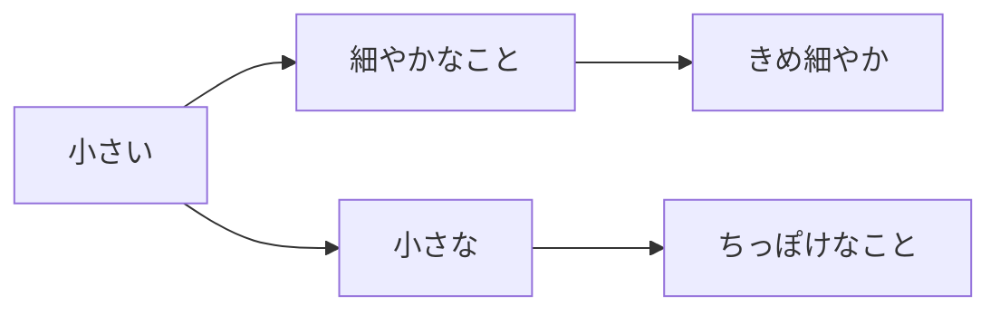

- 小さい「ちいさい」小
- 小さな「ちいさな」小的（偏生硬）
- 細やかなこと「ささやか」小事
- ちっぽけなこと（微不足道的事）
- きめ細やか「きめこまやか」纹理细腻｜細い「ほそい」｜細かい「こまかい」

## 轻的

- 軽い「かるい」轻（欠く｜欠かせない｜不可欠｜刈る「かる」砍
- 軽々しい言動「かるがるしいげんどう」轻浮的言行
- 軽率「けいそつ」轻率
- 軽やかな足どり「かろやかなあしどり」轻盈的步伐
- 手取り「てどり」纯收入｜「てとり」手把手

## 深的

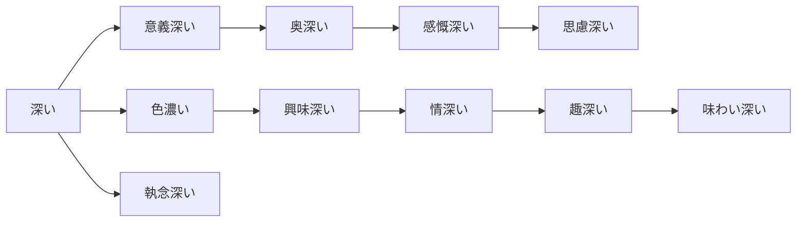

- 深い「ふかい」深

  - 更ける・老ける「ふける」

- 意義深い「いぎぶかい」意义深远

  - 奥深い「おくぶかい」深奥
  - 感慨深い「かんがいぶかい」深有感触｜感触「かんしょく」触摸的感觉
  - 思慮深い「しりょぶかい」深思熟虑｜慮る「おもんばかる」仔细考虑

- 色濃い「いろこい」颜色浓重

  - 興味深い「きょうみぶかい」引人入胜
  - 情け深い「なさけぶかい」情深，仁慈
  - 趣深い「おもむきぶかい」妙趣横生
  - 味わい深い「あじわいぶかい」趣味盎然

- 執念深い「しゅうねんぶかい」执念深；特记仇｜淡々と（淡漠，清淡）

## 多的

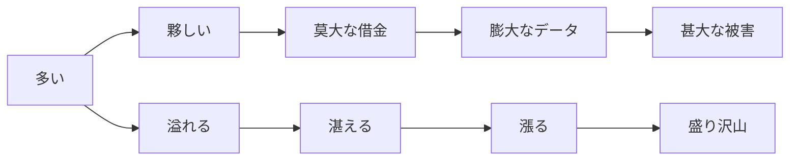

- 多い「おおい」多

  - 夥しい「おびただしい」众多，巨大
  - 莫大な借金「ばくだい」巨额债务（金钱）
  - 膨大なデータ「ぼうだい」海量数据（数据）
  - 甚大な被害「じんだい」重大损害（事项）

- 溢れる「あふれる」溢出

  - 湛える「たたえる」充满｜讃える・称える「たたえる」
  - 漲る「みなぎる」充盈
  - 盛り沢山「もりざくさん」丰富多样

## 重的

- 重い「おもい」重
- 重たい「おもたい」沉重
- 重々しい「おもおもしい」庄严
- 重々しい態度「おもおもしいたいど」庄重沉重的态度
- 毅然たる態度「きぜんたるたいど」坚定的态度
