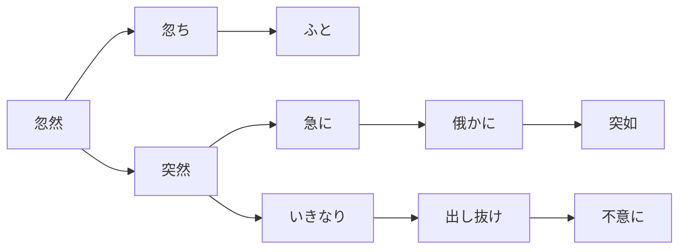
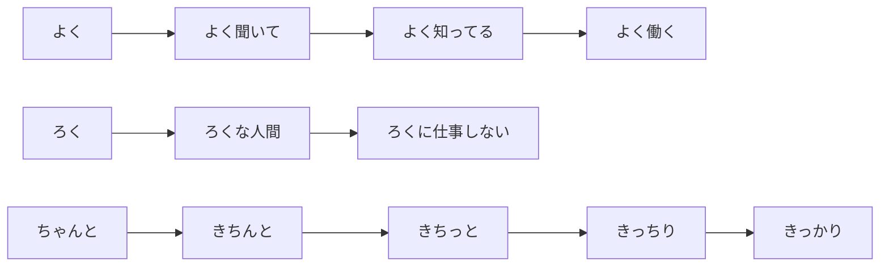
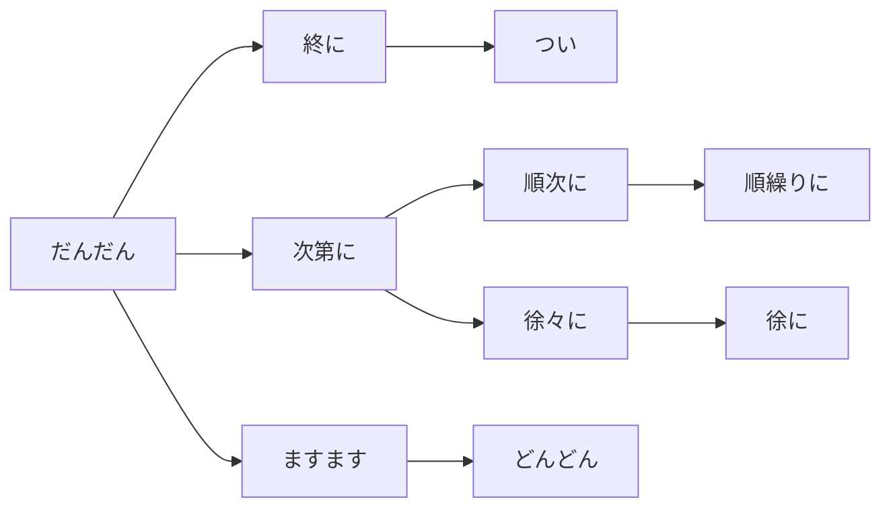
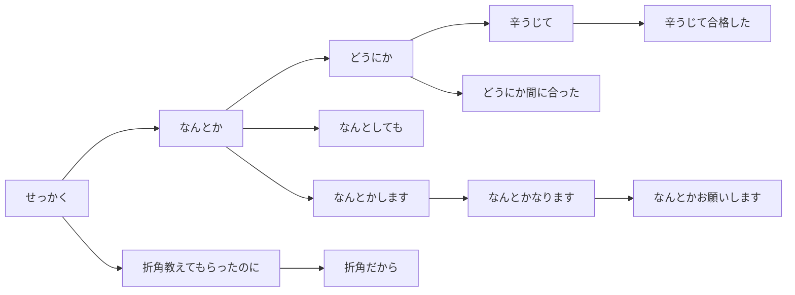
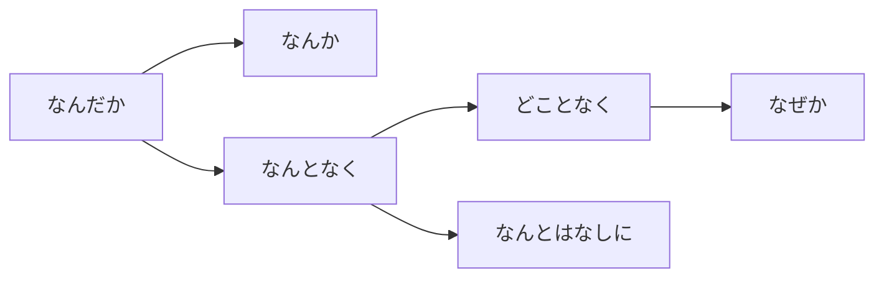
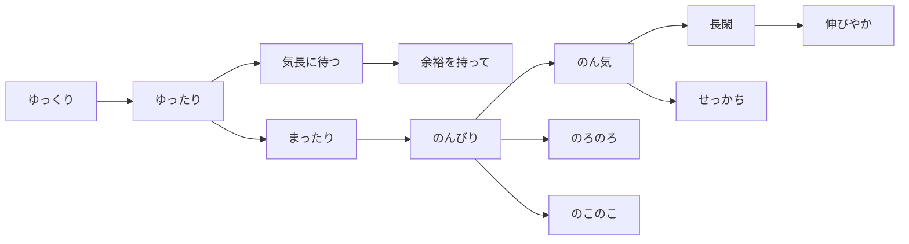
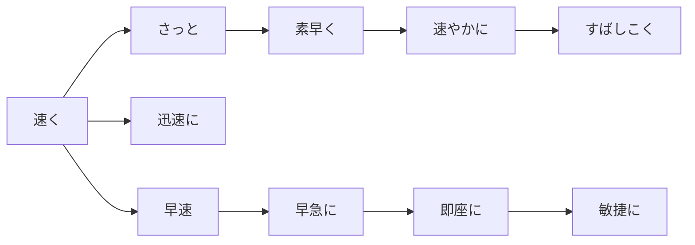

# 副词

## 用法

- 副词：に、く、と
- 拟声词拟态词：する、なる

## 突然、忽然

- 忽然「こつぜん」忽然

  - 忽ち「たちまち」立刻
  - ふと（忽然，偶然）ふと思い出した。

- 突然「とつぜん」突然，出人意料

  - 急に「きゅうに」急忙（速度）
  - 俄かに「にわかに」突然，立即｜俄に天気が変わった。｜俄雨「にわかあめ」
  - 突如「とつじょ」突如

- いきなり（突然）

  - 出し抜け「だしぬけ」出乎意料，措手不及
  - 不意に「ふいに」意外地

## 好好地

- よく（好，经常）

  - よく聞いて（好好听）
  - よく知ってる（很了解）
  - よく働く（勤劳）

- ろく「碌」好

  - ろくな人間（好人）
  - ろくに仕事しない（不好好工作）

- ちゃんと（好好地）

  - きちんと（整齐地）
  - きちっと（整齐地）
  - きっちり（恰好）｜きっちりとした（毕恭毕敬的）
  - きっかり（整；正好）

## 渐渐地

- だんだん（渐渐）

  - ますます（越来越…）
  - どんどん（迅速地）

- 次第に「しだいに」逐渐

  - 徐々に「じょじょに」慢慢地
  - 徐に「おもむろに」缓慢地

- 順次に「じゅんじに」依次

  - 順繰りに「じゅんぐりに」按顺序

- 終に「ついに」终于

  - つい（不经意）

## 好不容易

- せっかく「折角」费了好大劲

  - 折角教えてもらったのに（虽然费劲得到指导）
  - 折角だから（好不容易）

- なんとか（有困难，却；设法）

  - なんとしても（无论如何也要）
  - なんとかします（我会想办法的）
  - なんとかお願いします（请务必帮忙）

- どうにか（好歹）

  - どうにか間に合った（勉强赶上了）
  - なんとかなります｜会有办法的

- 辛うじて「かろうじて」勉强，好不容易

  - 辛うじて合格した（勉强及格）

## 不知道什么原因

- なんだか（不知为何）

  - なんか［语气助词］轻视；自谦（「など」的口语形式）

- なんとなく（不知怎的）→ 可以单独使用

  - なんとはなしに（不知何故）

- どことなく（不知为何）

  - なぜか（不知为何）

## 特意、特地

- わざわざ（特意）
- 心を込めて「こころをこめて」倾心
- わざと（成心，故意）
- 故意に「こいに」故意

## 慢慢地

- ゆっくり（慢慢地）
- ゆったり（宽敞，舒适）

  - 気長に待つ「きながにまつ」耐心等待
  - 余裕を持って「よゆう」从容

- まったり（慢慢地；放松）

  - のんびり（悠闲）
  - のん気「のんき」随和；慢性子
  - せっかち（急性子）
  - 長閑「のどか」悠闲
  - 伸びやか「のびやか」自由自在，悠闲

- のろのろ（慢吞吞）

  - のこのこ（满不在乎地，大摇大摆）

## 快快地

- 速く「はやく」快速
- 迅速に「じんそくに」迅速地
- さっと「さっと」迅速地
  - 素早く「すばやく」迅速
  - 速やかに「すみやかに」迅速地
  - すばしこく「すばしこく」灵巧地
- 早速「さっそく」立即（［惯用］早速ですが）
  - 早急に「さっきゅう・そうきゅう」紧急地
  - 即座に「そくざに」立刻
  - 敏捷に「びんしょうに」敏捷地

## 相当

- 相当「そうとう」相当（语气重）
- だいぶ（相当多）
- ずいぶん「随分」相当（超出预期）
- よほど「余程」非常（［口］よっぽど「余っ程」）
  - よっぽどのことがなければ（除非有大事；没有特殊情况的话）
- かなり「かなり」相当（日语的相当）
- 一角「ひとかど」相当，极其，特别
- 中々の「なかなかの」相当的（中々の腕前）
  - 中々・とても →70 分（用于否定的多）

## 非常

- 非常に「ひじょうに」非常
- とても「とても」［硬］非常
  - 大変「たいへん」［硬］非常
  - すごく「すごく」［口］非常
  - 結構「けっこう」［口］相当
- いやに「いやに」非常（轻微的贬义或惊讶）
  - やけに「やけに」非常（轻微的贬义或惊讶）
- 極めて「きわめて」［书］极其
  - 甚だ「はなはだ」［书］非常
  - 頗る「すこぶる」［书］非常，颇为
  - 極「ごく」极｜極一部（极少部分）｜極当たり前（极其理所应当）
  - 大いに「おおいに」非常

## 特别

- 特に「とくに」特别
  - 特別（に）「とくべつ」特别地
  - 特別扱いする「とくべつあつかい」特别对待
  - 格別に「かくべつ」格外
  - とりわけ「とりわけ」尤其
- 殊に「ことに」尤其
  - 殊更「ことさら」格外；故意
  - 別段「べつだん」并非特别
  - 遥かに「はるかに」特别（用于比较）
  - 一際「ひときわ」格外地
  - 一入「ひとしお」极为

## 整个、简直

- まるで〜ようだ／みたいだ（整个就像）
- 恰も「あたかも」恰似，恰如
- 宛ら「さながら」宛如（〜如し）
- どうやら／いかにも〜らしい（似乎／确实像）
